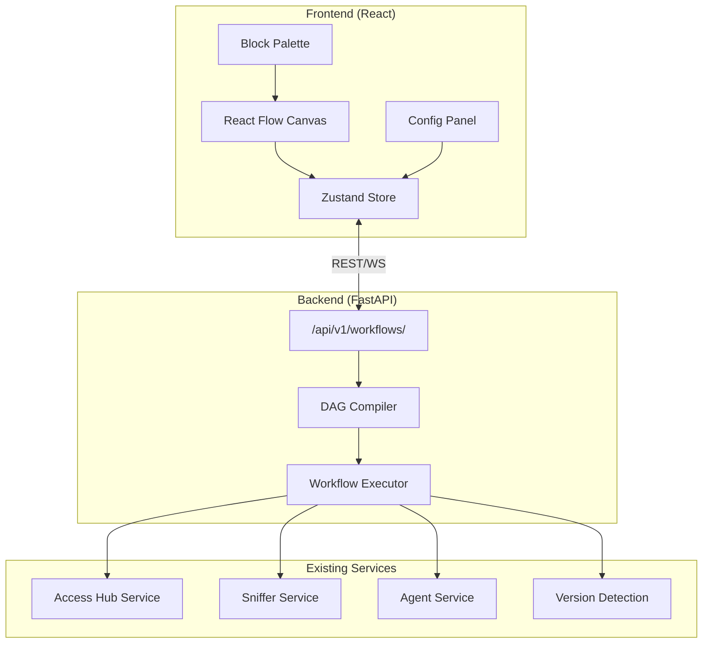
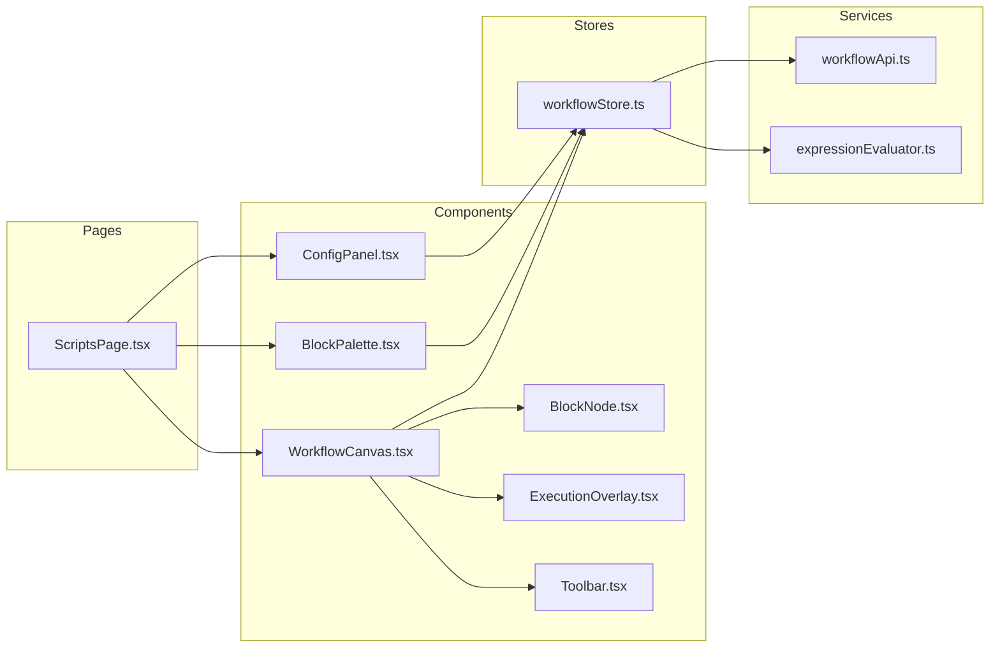
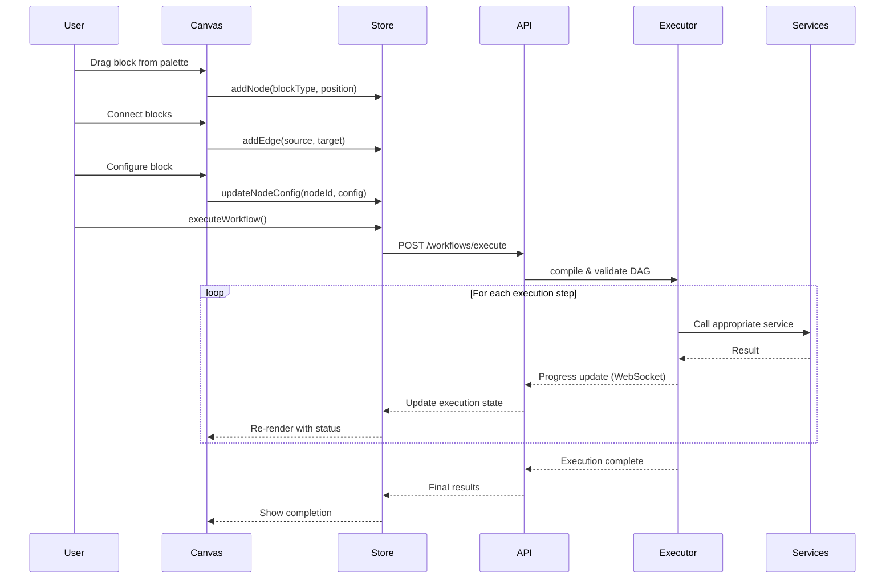
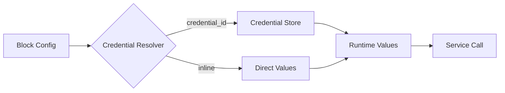

# Architecture Blueprint: NOP Workflow Automation

> **Version**: 1.0  
> **Status**: Draft for Review  
> **Created**: 2026-01-10  

## Overview

The Workflow Automation system enables users to visually create, configure, and execute network operations workflows using a drag-and-drop node-based interface. Built on React Flow (xyflow), it provides a DAG-based execution model with Mustache-style expression support.

## High-Level Architecture



## Component Architecture



## Data Flow



## State Management Design (Zustand)

```typescript
// frontend/src/store/workflowStore.ts

interface WorkflowState {
  // Workflow Data
  workflows: Workflow[];
  currentWorkflow: Workflow | null;
  
  // Canvas State
  nodes: Node[];
  edges: Edge[];
  selectedNodeId: string | null;
  
  // Execution State
  executionState: ExecutionState | null;
  nodeStatuses: Map<string, NodeExecutionStatus>;
  
  // UI State
  isPaletteOpen: boolean;
  isConfigPanelOpen: boolean;
  zoom: number;
  
  // Actions
  addNode: (type: BlockType, position: Position) => void;
  removeNode: (id: string) => void;
  addEdge: (connection: Connection) => void;
  removeEdge: (id: string) => void;
  updateNodeConfig: (id: string, config: BlockConfig) => void;
  
  // Workflow Actions
  saveWorkflow: () => Promise<void>;
  loadWorkflow: (id: string) => Promise<void>;
  executeWorkflow: () => Promise<void>;
  stopExecution: () => void;
  
  // Selection
  selectNode: (id: string | null) => void;
}
```

## File/Folder Structure

```
frontend/src/
├── pages/
│   └── Scripts/
│       └── ScriptsPage.tsx          # Main page component
│
├── components/
│   └── workflow/
│       ├── WorkflowCanvas.tsx       # React Flow wrapper
│       ├── BlockNode.tsx            # Custom node component
│       ├── BlockPalette.tsx         # Draggable block list
│       ├── ConfigPanel.tsx          # Right-side configuration
│       ├── ExecutionOverlay.tsx     # Status indicators
│       ├── Toolbar.tsx              # Save, run, zoom controls
│       ├── MiniMap.tsx              # Navigation minimap
│       │
│       ├── blocks/                  # Block-specific components
│       │   ├── ConnectionBlock.tsx
│       │   ├── CommandBlock.tsx
│       │   ├── TrafficBlock.tsx
│       │   ├── ScanBlock.tsx
│       │   ├── AgentBlock.tsx
│       │   └── ControlBlock.tsx
│       │
│       └── handles/                 # Custom handles
│           ├── InputHandle.tsx
│           └── OutputHandle.tsx
│
├── store/
│   └── workflowStore.ts             # Zustand store
│
├── services/
│   ├── workflowApi.ts               # API calls
│   └── expressionEvaluator.ts       # Mustache evaluation
│
├── types/
│   └── workflow.ts                  # TypeScript interfaces
│
└── utils/
    └── dagCompiler.ts               # Client-side DAG utilities


backend/app/
├── api/v1/endpoints/
│   └── workflows.py                 # Workflow CRUD + execution
│
├── models/
│   └── workflow.py                  # SQLAlchemy model
│
├── schemas/
│   └── workflow.py                  # Pydantic schemas
│
├── services/
│   └── workflow_executor.py         # DAG execution engine
│
└── utils/
    ├── dag_compiler.py              # DAG validation/sorting
    └── expression_evaluator.py      # Mustache expression resolver
```

## Technology Stack

| Layer | Technology | Purpose |
|-------|------------|---------|
| Canvas | React Flow (xyflow) | Node-based visual editor |
| State | Zustand | Global state management |
| Styling | Tailwind CSS | Responsive dark-theme UI |
| API | FastAPI | Async REST/WebSocket |
| Database | PostgreSQL | Workflow persistence |
| Execution | asyncio | Parallel block execution |

## Integration Points

### Existing Services Used

| Service | Location | Used For |
|---------|----------|----------|
| `access_hub` | `backend/app/services/access_hub.py` | SSH, RDP, VNC, FTP, TCP |
| `sniffer_service` | `backend/app/services/SnifferService.py` | Traffic capture/analysis |
| `ping_service` | `backend/app/services/PingService.py` | Network ping operations |
| `AgentService` | `backend/app/services/agent_service.py` | Agent generation/management |
| `VersionDetectionService` | `backend/app/services/version_detection.py` | nmap version scanning |

### Credential Resolution

Credentials are resolved at execution time from the credentials store:



## Security Considerations

1. **Credential Storage**: Never store plain credentials in workflow definitions
2. **Expression Injection**: Sanitize Mustache expressions before evaluation
3. **API Authorization**: All workflow endpoints require authentication
4. **Execution Isolation**: Each execution runs in isolated context
5. **Audit Logging**: All workflow executions logged to events table

## Performance Considerations

1. **Canvas Virtualization**: React Flow handles large graphs efficiently
2. **Lazy Loading**: Block definitions loaded on-demand
3. **WebSocket Streaming**: Real-time execution updates
4. **Parallel Execution**: Independent branches execute concurrently
5. **State Debouncing**: Canvas updates debounced for performance

---

## Next Steps

1. Review [BLOCKS.md](./BLOCKS.md) for complete block catalog
2. Review [EXECUTION.md](./EXECUTION.md) for execution engine details
3. Review [UI_COMPONENTS.md](./UI_COMPONENTS.md) for component specifications
4. Review [DATA_MODELS.md](./DATA_MODELS.md) for TypeScript interfaces
5. Review [PHASES.md](./PHASES.md) for implementation timeline
