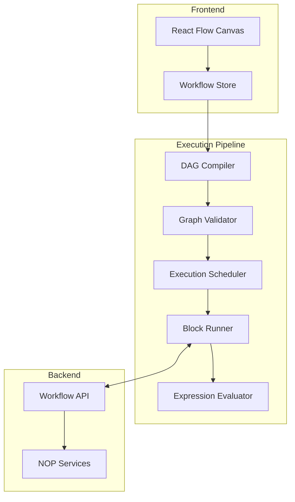
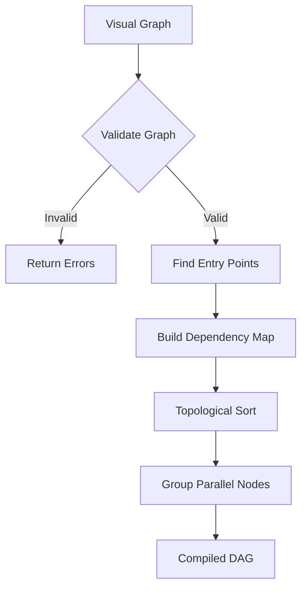
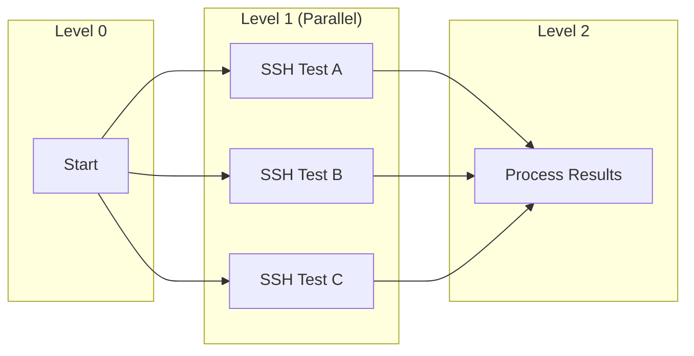
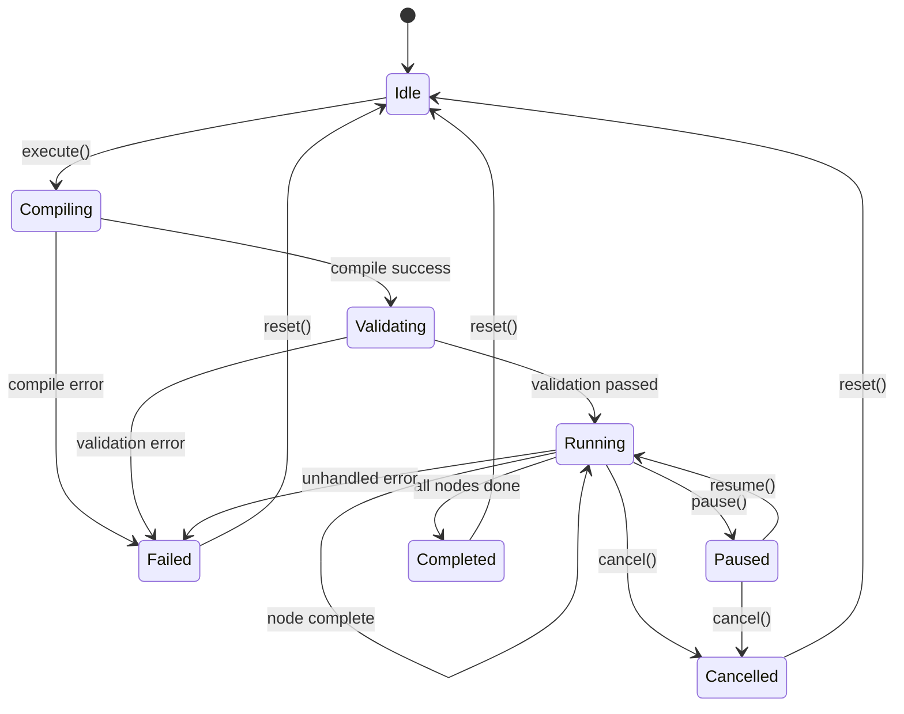
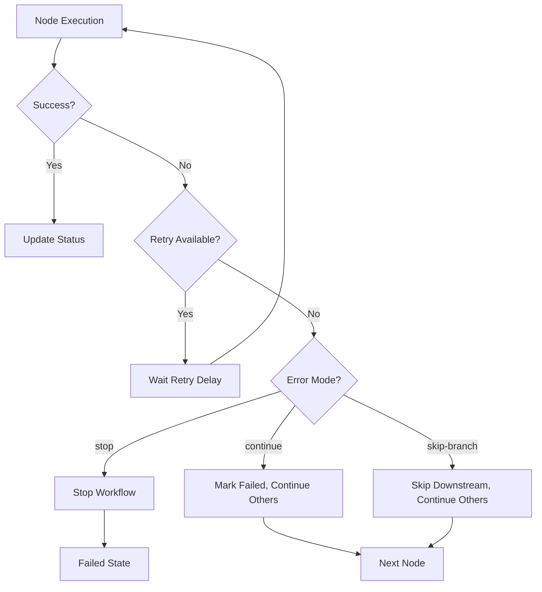
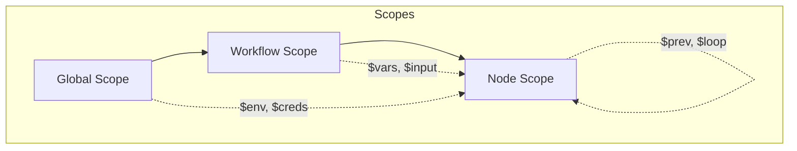

# Execution Engine Blueprint: NOP Workflow Automation

> **Version**: 1.0  
> **Status**: Draft for Review  
> **Created**: 2026-01-10  

## Overview

The Execution Engine is responsible for compiling visual workflows into executable DAGs, managing execution order, handling parallel branches, and coordinating with backend services.

## Architecture



## DAG Compilation

### Graph to DAG Transformation

The visual graph is compiled into a Directed Acyclic Graph (DAG) for execution:

```typescript
// frontend/src/utils/dagCompiler.ts

interface CompiledDAG {
  nodes: ExecutableNode[];
  edges: ExecutionEdge[];
  executionOrder: string[][];  // Array of parallel groups
  entryPoints: string[];       // Start node IDs
  exitPoints: string[];        // End node IDs
  variables: Map<string, any>; // Initial variables
}

interface ExecutableNode {
  id: string;
  type: BlockType;
  config: BlockConfig;
  inputs: string[];            // Incoming edge IDs
  outputs: Record<string, string[]>; // Handle -> target node IDs
  dependencies: string[];      // Node IDs that must complete first
}

interface ExecutionEdge {
  id: string;
  source: string;
  sourceHandle: string;
  target: string;
  targetHandle: string;
  condition?: string;          // For conditional edges
}
```

### Compilation Process



### Cycle Detection

DAGs cannot have cycles. The compiler uses Kahn's algorithm:

```typescript
function detectCycles(nodes: Node[], edges: Edge[]): string[] | null {
  const inDegree = new Map<string, number>();
  const adjacency = new Map<string, string[]>();
  
  // Initialize
  nodes.forEach(node => {
    inDegree.set(node.id, 0);
    adjacency.set(node.id, []);
  });
  
  // Build graph
  edges.forEach(edge => {
    adjacency.get(edge.source)!.push(edge.target);
    inDegree.set(edge.target, inDegree.get(edge.target)! + 1);
  });
  
  // Find nodes with no incoming edges
  const queue: string[] = [];
  inDegree.forEach((degree, nodeId) => {
    if (degree === 0) queue.push(nodeId);
  });
  
  const sorted: string[] = [];
  while (queue.length > 0) {
    const node = queue.shift()!;
    sorted.push(node);
    
    adjacency.get(node)!.forEach(neighbor => {
      const newDegree = inDegree.get(neighbor)! - 1;
      inDegree.set(neighbor, newDegree);
      if (newDegree === 0) queue.push(neighbor);
    });
  }
  
  // If we couldn't sort all nodes, there's a cycle
  if (sorted.length !== nodes.length) {
    return null; // Cycle detected
  }
  
  return sorted;
}
```

### Topological Sort for Execution Order

```typescript
function computeExecutionOrder(dag: CompiledDAG): string[][] {
  const levels: string[][] = [];
  const nodeLevel = new Map<string, number>();
  
  // Assign levels based on dependencies
  function assignLevel(nodeId: string): number {
    if (nodeLevel.has(nodeId)) return nodeLevel.get(nodeId)!;
    
    const node = dag.nodes.find(n => n.id === nodeId)!;
    if (node.dependencies.length === 0) {
      nodeLevel.set(nodeId, 0);
      return 0;
    }
    
    const maxDepLevel = Math.max(
      ...node.dependencies.map(dep => assignLevel(dep))
    );
    const level = maxDepLevel + 1;
    nodeLevel.set(nodeId, level);
    return level;
  }
  
  // Assign levels to all nodes
  dag.nodes.forEach(node => assignLevel(node.id));
  
  // Group nodes by level
  nodeLevel.forEach((level, nodeId) => {
    if (!levels[level]) levels[level] = [];
    levels[level].push(nodeId);
  });
  
  return levels;
}
```

## Parallel Execution Groups

Nodes at the same level with no dependencies between them can execute in parallel:



### Parallel Execution Strategy

```typescript
interface ParallelExecutionGroup {
  level: number;
  nodes: string[];
  dependencies: Set<string>;  // All nodes from previous levels
}

async function executeParallelGroup(
  group: ParallelExecutionGroup,
  context: ExecutionContext
): Promise<Map<string, NodeResult>> {
  const results = new Map<string, NodeResult>();
  
  // Execute all nodes in parallel
  const promises = group.nodes.map(async (nodeId) => {
    try {
      const result = await executeNode(nodeId, context);
      results.set(nodeId, result);
    } catch (error) {
      results.set(nodeId, {
        success: false,
        error: error.message,
        nodeId
      });
    }
  });
  
  await Promise.all(promises);
  return results;
}
```

## Execution State Machine



### Execution State Interface

```typescript
type ExecutionStatus = 
  | 'idle' 
  | 'compiling' 
  | 'validating' 
  | 'running' 
  | 'paused' 
  | 'completed' 
  | 'failed' 
  | 'cancelled';

interface ExecutionState {
  status: ExecutionStatus;
  workflowId: string;
  startedAt: Date | null;
  completedAt: Date | null;
  currentLevel: number;
  totalLevels: number;
  
  // Node-level tracking
  nodeStatuses: Map<string, NodeExecutionStatus>;
  nodeResults: Map<string, NodeResult>;
  
  // Error handling
  errors: ExecutionError[];
  errorHandling: ErrorHandlingMode;
  
  // Variables
  variables: Map<string, any>;
  
  // Progress
  progress: {
    completed: number;
    total: number;
    percentage: number;
  };
}

type NodeExecutionStatus = 
  | 'pending' 
  | 'waiting' 
  | 'running' 
  | 'completed' 
  | 'failed' 
  | 'skipped';

interface NodeResult {
  nodeId: string;
  success: boolean;
  output: any;
  error?: string;
  startedAt: Date;
  completedAt: Date;
  duration: number;
}
```

## Error Handling

### Error Handling Modes

```typescript
type ErrorHandlingMode = 
  | 'stop'           // Stop entire workflow on first error
  | 'continue'       // Continue other branches, skip failed branch
  | 'skip-branch';   // Skip remaining nodes in failed branch only

interface ErrorHandlingConfig {
  mode: ErrorHandlingMode;
  retryCount: number;         // Number of retries per node
  retryDelay: number;         // Delay between retries (ms)
  onError?: string;           // Error handler node ID
}
```

### Error Handling Flow



### Retry Logic

```typescript
async function executeNodeWithRetry(
  node: ExecutableNode,
  context: ExecutionContext,
  config: ErrorHandlingConfig
): Promise<NodeResult> {
  let lastError: Error | null = null;
  
  for (let attempt = 0; attempt <= config.retryCount; attempt++) {
    try {
      if (attempt > 0) {
        await delay(config.retryDelay);
        context.emit('nodeRetry', { 
          nodeId: node.id, 
          attempt 
        });
      }
      
      const result = await executeNode(node, context);
      return result;
      
    } catch (error) {
      lastError = error;
      context.emit('nodeError', { 
        nodeId: node.id, 
        error: error.message,
        attempt,
        willRetry: attempt < config.retryCount
      });
    }
  }
  
  throw lastError;
}
```

## Variable Scoping and Expression Evaluation

### Variable Scopes



### Execution Context

```typescript
interface ExecutionContext {
  // Scopes
  globalScope: Map<string, any>;      // Environment, credentials
  workflowScope: Map<string, any>;    // Workflow variables
  nodeScope: Map<string, any>;        // Current node context
  
  // Results from previous nodes
  previousResults: Map<string, NodeResult>;
  
  // Current execution position
  currentNodeId: string | null;
  loopContext: LoopContext | null;
  
  // Event emitter for progress updates
  emit: (event: string, data: any) => void;
  
  // Resolve a variable path
  resolve: (path: string) => any;
  
  // Evaluate an expression
  evaluate: (expression: string) => any;
}

interface LoopContext {
  index: number;
  iteration: number;
  first: boolean;
  last: boolean;
  item: any;
  array: any[];
}
```

### Expression Evaluator

```typescript
// backend/app/utils/expression_evaluator.py
// or frontend/src/services/expressionEvaluator.ts

interface ExpressionEvaluator {
  evaluate(expression: string, context: ExecutionContext): any;
}

class MustacheExpressionEvaluator implements ExpressionEvaluator {
  private readonly EXPRESSION_REGEX = /\{\{\s*(.+?)\s*\}\}/g;
  
  evaluate(expression: string, context: ExecutionContext): any {
    // Simple value (no mustache)
    if (!expression.includes('{{')) {
      return expression;
    }
    
    // Full expression replacement
    const fullMatch = expression.match(/^\{\{\s*(.+?)\s*\}\}$/);
    if (fullMatch) {
      return this.evaluatePath(fullMatch[1], context);
    }
    
    // Template interpolation
    return expression.replace(this.EXPRESSION_REGEX, (_, path) => {
      const value = this.evaluatePath(path.trim(), context);
      return value?.toString() ?? '';
    });
  }
  
  private evaluatePath(path: string, context: ExecutionContext): any {
    // Handle filters: {{ $prev.stdout | trim }}
    const [basePath, ...filters] = path.split('|').map(s => s.trim());
    
    let value = this.resolvePath(basePath, context);
    
    // Apply filters
    for (const filter of filters) {
      value = this.applyFilter(value, filter);
    }
    
    return value;
  }
  
  private resolvePath(path: string, context: ExecutionContext): any {
    const parts = path.split('.');
    const root = parts[0];
    
    let value: any;
    
    switch (root) {
      case '$prev':
        // Previous node output
        if (parts.length === 1) {
          value = context.previousResults.get(context.currentNodeId!)?.output;
        } else if (!isNaN(parseInt(parts[1]))) {
          // Specific previous node by index
          const index = parseInt(parts[1]);
          const nodeIds = Array.from(context.previousResults.keys());
          value = context.previousResults.get(nodeIds[index])?.output;
          parts.splice(1, 1); // Remove index from path
        } else {
          value = context.previousResults.get(context.currentNodeId!)?.output;
        }
        break;
        
      case '$vars':
        value = context.workflowScope;
        break;
        
      case '$env':
        value = context.globalScope.get('env');
        break;
        
      case '$creds':
        value = context.globalScope.get('credentials');
        break;
        
      case '$loop':
        value = context.loopContext;
        break;
        
      case '$input':
        value = context.workflowScope.get('input');
        break;
        
      default:
        // Direct variable reference
        value = context.workflowScope.get(root) ?? 
                context.globalScope.get(root);
    }
    
    // Navigate remaining path
    for (let i = 1; i < parts.length; i++) {
      if (value == null) break;
      value = value[parts[i]];
    }
    
    return value;
  }
  
  private applyFilter(value: any, filter: string): any {
    const [name, ...args] = filter.split(/[()]/);
    
    switch (name.trim()) {
      case 'trim':
        return typeof value === 'string' ? value.trim() : value;
      case 'upper':
        return typeof value === 'string' ? value.toUpperCase() : value;
      case 'lower':
        return typeof value === 'string' ? value.toLowerCase() : value;
      case 'length':
        return Array.isArray(value) ? value.length : 
               typeof value === 'string' ? value.length : 0;
      case 'split':
        const delimiter = args[0]?.replace(/['"]/g, '') ?? ',';
        return typeof value === 'string' ? value.split(delimiter) : [value];
      case 'join':
        const joiner = args[0]?.replace(/['"]/g, '') ?? ',';
        return Array.isArray(value) ? value.join(joiner) : value;
      case 'default':
        const defaultVal = args[0]?.replace(/['"]/g, '');
        return value ?? defaultVal;
      case 'first':
        return Array.isArray(value) ? value[0] : value;
      case 'last':
        return Array.isArray(value) ? value[value.length - 1] : value;
      default:
        return value;
    }
  }
}
```

## Credential Resolution

Credentials are never stored in workflow definitions. They are resolved at runtime:

```typescript
interface CredentialResolver {
  resolve(credentialId: string): Promise<Credential>;
}

// Backend implementation
class SecureCredentialResolver implements CredentialResolver {
  constructor(private db: AsyncSession) {}
  
  async resolve(credentialId: string): Promise<Credential> {
    // Fetch from encrypted credential store
    const credential = await this.db.query(
      Credential
    ).where(
      Credential.id == credentialId
    ).first();
    
    if (!credential) {
      throw new Error(`Credential not found: ${credentialId}`);
    }
    
    // Decrypt sensitive fields
    return {
      ...credential,
      password: decrypt(credential.encrypted_password),
      private_key: credential.encrypted_key ? 
        decrypt(credential.encrypted_key) : null
    };
  }
}
```

### Credential Reference in Config

```typescript
// Block configuration with credential reference
interface BlockConfig {
  host: string;
  port: number;
  
  // Option 1: Direct values (development only)
  username?: string;
  password?: string;
  
  // Option 2: Credential reference (production)
  credential_id?: string;
}

// Resolution at runtime
async function resolveCredentials(
  config: BlockConfig,
  resolver: CredentialResolver
): Promise<ResolvedBlockConfig> {
  if (config.credential_id) {
    const cred = await resolver.resolve(config.credential_id);
    return {
      ...config,
      username: cred.username,
      password: cred.password,
      key_file: cred.private_key
    };
  }
  return config as ResolvedBlockConfig;
}
```

## Execution Flow

### Main Execution Loop

```typescript
async function executeWorkflow(
  dag: CompiledDAG,
  options: ExecutionOptions
): Promise<ExecutionResult> {
  const context = createExecutionContext(dag, options);
  const state = createExecutionState(dag);
  
  try {
    // Execute level by level
    for (let level = 0; level < dag.executionOrder.length; level++) {
      state.currentLevel = level;
      const nodes = dag.executionOrder[level];
      
      // Check for cancellation
      if (state.status === 'cancelled') break;
      
      // Check for pause
      while (state.status === 'paused') {
        await delay(100);
        if (state.status === 'cancelled') break;
      }
      
      // Execute parallel group
      const results = await executeParallelGroup(
        { level, nodes, dependencies: new Set() },
        context
      );
      
      // Process results
      for (const [nodeId, result] of results) {
        state.nodeStatuses.set(nodeId, 
          result.success ? 'completed' : 'failed'
        );
        state.nodeResults.set(nodeId, result);
        
        // Update context for next level
        context.previousResults.set(nodeId, result);
        
        // Handle errors based on mode
        if (!result.success) {
          handleNodeError(nodeId, result, state, options);
        }
      }
      
      // Update progress
      state.progress.completed = Array.from(state.nodeStatuses.values())
        .filter(s => s === 'completed' || s === 'failed' || s === 'skipped')
        .length;
      state.progress.percentage = 
        (state.progress.completed / state.progress.total) * 100;
      
      // Emit progress event
      context.emit('progress', state.progress);
    }
    
    state.status = state.errors.length > 0 ? 'failed' : 'completed';
    state.completedAt = new Date();
    
    return {
      success: state.status === 'completed',
      state,
      outputs: extractOutputs(dag, state)
    };
    
  } catch (error) {
    state.status = 'failed';
    state.errors.push({
      type: 'execution',
      message: error.message,
      nodeId: context.currentNodeId
    });
    throw error;
  }
}
```

### Control Flow Blocks

#### Condition Block Execution

```typescript
async function executeConditionBlock(
  node: ExecutableNode,
  context: ExecutionContext
): Promise<ConditionResult> {
  const config = node.config as ConditionBlockConfig;
  
  // Evaluate condition expression
  const result = context.evaluate(config.expression);
  const isTruthy = Boolean(result);
  
  return {
    success: true,
    output: {
      condition: config.expression,
      result: isTruthy
    },
    nextHandle: isTruthy ? 'true' : 'false'
  };
}
```

#### Loop Block Execution

```typescript
async function executeLoopBlock(
  node: ExecutableNode,
  context: ExecutionContext,
  executeSubgraph: (nodeIds: string[], ctx: ExecutionContext) => Promise<void>
): Promise<LoopResult> {
  const config = node.config as LoopBlockConfig;
  
  // Determine iteration source
  let items: any[];
  if (config.mode === 'count') {
    items = Array.from({ length: config.count }, (_, i) => i);
  } else {
    items = context.evaluate(config.array);
    if (!Array.isArray(items)) {
      throw new Error('Loop array expression must return an array');
    }
  }
  
  const results: any[] = [];
  
  for (let i = 0; i < items.length; i++) {
    // Set loop context
    context.loopContext = {
      index: i,
      iteration: i + 1,
      first: i === 0,
      last: i === items.length - 1,
      item: items[i],
      array: items
    };
    
    // Set variable
    context.workflowScope.set(config.variable_name, items[i]);
    
    // Execute iteration subgraph
    const iterationNodes = node.outputs['iteration'] ?? [];
    await executeSubgraph(iterationNodes, context);
    
    results.push(context.previousResults);
  }
  
  // Clear loop context
  context.loopContext = null;
  
  return {
    success: true,
    output: {
      iterations: items.length,
      results
    },
    nextHandle: 'complete'
  };
}
```

#### Parallel Block Execution

```typescript
async function executeParallelBlock(
  node: ExecutableNode,
  context: ExecutionContext,
  executeSubgraph: (nodeIds: string[], ctx: ExecutionContext) => Promise<void>
): Promise<ParallelResult> {
  const config = node.config as ParallelBlockConfig;
  
  // Get all branch outputs
  const branches = Object.entries(node.outputs)
    .filter(([handle]) => handle.startsWith('branch_'));
  
  // Create isolated contexts for each branch
  const branchPromises = branches.map(async ([handle, nodeIds]) => {
    const branchContext = cloneContext(context);
    try {
      await executeSubgraph(nodeIds, branchContext);
      return { handle, success: true, results: branchContext.previousResults };
    } catch (error) {
      return { handle, success: false, error: error.message };
    }
  });
  
  // Wait for all or timeout
  const results = await Promise.race([
    Promise.all(branchPromises),
    timeout(config.timeout * 1000).then(() => {
      throw new Error('Parallel execution timeout');
    })
  ]);
  
  // Merge results
  const mergedResults = new Map<string, any>();
  for (const result of results) {
    if (result.success) {
      result.results.forEach((v, k) => mergedResults.set(k, v));
    }
  }
  
  return {
    success: results.every(r => r.success),
    output: {
      branches: results.length,
      results: Object.fromEntries(mergedResults)
    },
    nextHandle: 'out'
  };
}
```

## WebSocket Progress Updates

Real-time execution progress is streamed via WebSocket:

```typescript
// Backend WebSocket handler
@router.websocket("/workflows/{workflow_id}/execute")
async def workflow_execution_ws(
    websocket: WebSocket,
    workflow_id: UUID,
    db: AsyncSession = Depends(get_db)
):
    await websocket.accept()
    
    try:
        # Load workflow
        workflow = await get_workflow(db, workflow_id)
        
        # Create event emitter
        async def emit(event: str, data: dict):
            await websocket.send_json({
                "event": event,
                "data": data,
                "timestamp": datetime.utcnow().isoformat()
            })
        
        # Execute with progress updates
        result = await execute_workflow(
            workflow,
            on_progress=lambda p: emit("progress", p),
            on_node_start=lambda n: emit("node_start", n),
            on_node_complete=lambda n: emit("node_complete", n),
            on_node_error=lambda n: emit("node_error", n)
        )
        
        await emit("complete", result)
        
    except Exception as e:
        await emit("error", {"message": str(e)})
    finally:
        await websocket.close()
```

### Frontend WebSocket Client

```typescript
// frontend/src/services/workflowExecutor.ts

class WorkflowExecutor {
  private ws: WebSocket | null = null;
  
  async execute(
    workflowId: string,
    onProgress: (state: ExecutionState) => void
  ): Promise<ExecutionResult> {
    return new Promise((resolve, reject) => {
      const wsUrl = `${WS_BASE_URL}/workflows/${workflowId}/execute`;
      this.ws = new WebSocket(wsUrl);
      
      this.ws.onmessage = (event) => {
        const message = JSON.parse(event.data);
        
        switch (message.event) {
          case 'progress':
            onProgress(message.data);
            break;
          case 'node_start':
            onProgress({
              ...currentState,
              nodeStatuses: new Map([
                ...currentState.nodeStatuses,
                [message.data.nodeId, 'running']
              ])
            });
            break;
          case 'node_complete':
            // Update node status to completed
            break;
          case 'complete':
            resolve(message.data);
            break;
          case 'error':
            reject(new Error(message.data.message));
            break;
        }
      };
      
      this.ws.onerror = (error) => {
        reject(error);
      };
    });
  }
  
  cancel(): void {
    if (this.ws) {
      this.ws.send(JSON.stringify({ action: 'cancel' }));
    }
  }
  
  pause(): void {
    if (this.ws) {
      this.ws.send(JSON.stringify({ action: 'pause' }));
    }
  }
  
  resume(): void {
    if (this.ws) {
      this.ws.send(JSON.stringify({ action: 'resume' }));
    }
  }
}
```

## Backend API Endpoints

```python
# backend/app/api/v1/endpoints/workflows.py

router = APIRouter()

@router.get("/")
async def list_workflows(
    db: AsyncSession = Depends(get_db)
) -> List[WorkflowResponse]:
    """List all workflows"""
    pass

@router.post("/")
async def create_workflow(
    workflow: WorkflowCreate,
    db: AsyncSession = Depends(get_db)
) -> WorkflowResponse:
    """Create new workflow"""
    pass

@router.get("/{workflow_id}")
async def get_workflow(
    workflow_id: UUID,
    db: AsyncSession = Depends(get_db)
) -> WorkflowResponse:
    """Get workflow by ID"""
    pass

@router.put("/{workflow_id}")
async def update_workflow(
    workflow_id: UUID,
    workflow: WorkflowUpdate,
    db: AsyncSession = Depends(get_db)
) -> WorkflowResponse:
    """Update workflow"""
    pass

@router.delete("/{workflow_id}")
async def delete_workflow(
    workflow_id: UUID,
    db: AsyncSession = Depends(get_db)
) -> None:
    """Delete workflow"""
    pass

@router.post("/{workflow_id}/compile")
async def compile_workflow(
    workflow_id: UUID,
    db: AsyncSession = Depends(get_db)
) -> CompileResult:
    """Compile and validate workflow DAG"""
    pass

@router.post("/{workflow_id}/execute")
async def execute_workflow(
    workflow_id: UUID,
    options: ExecutionOptions,
    db: AsyncSession = Depends(get_db)
) -> ExecutionResponse:
    """Start workflow execution (returns immediately with execution ID)"""
    pass

@router.get("/{workflow_id}/executions")
async def list_executions(
    workflow_id: UUID,
    db: AsyncSession = Depends(get_db)
) -> List[ExecutionResponse]:
    """List workflow execution history"""
    pass

@router.get("/{workflow_id}/executions/{execution_id}")
async def get_execution(
    workflow_id: UUID,
    execution_id: UUID,
    db: AsyncSession = Depends(get_db)
) -> ExecutionDetailResponse:
    """Get execution details"""
    pass

@router.post("/{workflow_id}/executions/{execution_id}/cancel")
async def cancel_execution(
    workflow_id: UUID,
    execution_id: UUID,
    db: AsyncSession = Depends(get_db)
) -> None:
    """Cancel running execution"""
    pass
```

## Summary

The execution engine provides:

1. **DAG Compilation**: Visual graph → validated DAG with topological sort
2. **Parallel Execution**: Independent nodes execute concurrently
3. **Error Handling**: Configurable stop/continue/skip-branch modes
4. **Variable Scoping**: Global, workflow, and node-level scopes
5. **Expression Evaluation**: Mustache-style with filters
6. **Real-time Updates**: WebSocket progress streaming
7. **Credential Security**: Runtime resolution from secure store
