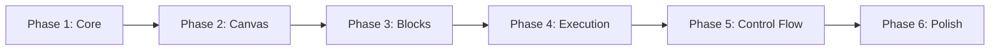

# Implementation Phases Blueprint: NOP Workflow Automation

> **Version**: 1.0  
> **Status**: Draft for Review  
> **Created**: 2026-01-10  

## Overview

This document outlines a phased implementation plan for the NOP Workflow Automation feature. Each phase builds upon the previous, allowing for incremental delivery and validation.

## Phase Summary

| Phase | Focus | Duration | Key Deliverables |
|-------|-------|----------|------------------|
| 1 | Core Infrastructure | 2 weeks | Data models, basic API, store |
| 2 | Visual Canvas | 2 weeks | React Flow integration, node rendering |
| 3 | Block Library | 2 weeks | All block types, API integration |
| 4 | Execution Engine | 2 weeks | DAG execution, progress tracking |
| 5 | Control Flow | 1 week | Conditions, loops, parallel |
| 6 | Polish & Advanced | 1 week | Expressions, credentials, UX |

**Total Estimated Duration: 10 weeks**

---

## Phase 1: Core Infrastructure

**Duration**: 2 weeks  
**Priority**: Critical  
**Dependencies**: None

### Goals
- Establish data models and database schema
- Create basic CRUD API for workflows
- Set up Zustand store with persistence
- Create page layout skeleton

### Deliverables

#### Week 1: Backend Foundation

| Task | Effort | Owner |
|------|--------|-------|
| Create Workflow SQLAlchemy model | 4h | Backend |
| Create WorkflowExecution model | 2h | Backend |
| Add Alembic migration | 1h | Backend |
| Implement Pydantic schemas | 4h | Backend |
| Create CRUD endpoints | 8h | Backend |
| Write endpoint tests | 4h | Backend |

**Backend Files:**
```
backend/app/
├── models/workflow.py          # NEW
├── schemas/workflow.py         # NEW
├── schemas/execution.py        # NEW
├── api/v1/endpoints/workflows.py # NEW
└── services/workflow_service.py  # NEW
```

#### Week 2: Frontend Foundation

| Task | Effort | Owner |
|------|--------|-------|
| Install React Flow | 1h | Frontend |
| Create TypeScript interfaces | 4h | Frontend |
| Implement Zustand store | 8h | Frontend |
| Create API client | 4h | Frontend |
| Build page layout | 8h | Frontend |
| Add routing | 2h | Frontend |

**Frontend Files:**
```
frontend/src/
├── types/workflow.ts           # NEW
├── types/blocks.ts             # NEW
├── types/execution.ts          # NEW
├── store/workflowStore.ts      # NEW
├── services/workflowApi.ts     # NEW
└── pages/Scripts/
    └── ScriptsPage.tsx         # NEW
```

### Acceptance Criteria
- [ ] Workflows can be created, read, updated, deleted via API
- [ ] Store persists workflow list to localStorage
- [ ] Page layout renders with three-panel structure
- [ ] Navigation to /scripts works

### Risks & Mitigations
| Risk | Impact | Mitigation |
|------|--------|------------|
| React Flow learning curve | Medium | Allocate extra time, use docs |
| Store complexity | Low | Use immer middleware |

---

## Phase 2: Visual Canvas

**Duration**: 2 weeks  
**Priority**: Critical  
**Dependencies**: Phase 1

### Goals
- Implement React Flow canvas with custom nodes
- Create block palette with drag-and-drop
- Build configuration panel
- Enable node connections

### Deliverables

#### Week 3: Canvas & Nodes

| Task | Effort | Owner |
|------|--------|-------|
| Configure React Flow | 4h | Frontend |
| Create BlockNode component | 8h | Frontend |
| Implement custom handles | 4h | Frontend |
| Add node styling by category | 4h | Frontend |
| Implement selection behavior | 4h | Frontend |
| Add MiniMap and Controls | 2h | Frontend |

**Key Components:**
```tsx
// WorkflowCanvas.tsx
<ReactFlow
  nodes={nodes}
  edges={edges}
  nodeTypes={{ block: BlockNode }}
  onNodesChange={onNodesChange}
  onEdgesChange={onEdgesChange}
  onConnect={onConnect}
/>
```

#### Week 4: Palette & Config Panel

| Task | Effort | Owner |
|------|--------|-------|
| Create BlockPalette component | 8h | Frontend |
| Implement drag-and-drop | 4h | Frontend |
| Build ConfigPanel component | 8h | Frontend |
| Create parameter inputs | 8h | Frontend |
| Add category filtering | 2h | Frontend |
| Implement panel toggles | 2h | Frontend |

### Acceptance Criteria
- [ ] Blocks can be dragged from palette to canvas
- [ ] Nodes render with correct styling and icons
- [ ] Nodes can be connected via handles
- [ ] Selected node shows config panel
- [ ] Node config can be edited
- [ ] Canvas supports zoom/pan

### Visual Milestone

```
┌─────────────┬──────────────────────────────┬──────────────┐
│ Block       │                              │ Config       │
│ Palette     │        React Flow Canvas     │ Panel        │
│             │                              │              │
│ ▾ Connection│     [SSH Test]               │ Host: ___    │
│   SSH Test  │         │                    │ Port: 22     │
│   RDP Test  │         ▼                    │ User: ___    │
│             │     [Execute]                │              │
│ ▾ Command   │                              │              │
│   Execute   │                              │              │
└─────────────┴──────────────────────────────┴──────────────┘
```

---

## Phase 3: Block Library

**Duration**: 2 weeks  
**Priority**: High  
**Dependencies**: Phase 2

### Goals
- Implement all block definitions
- Connect blocks to real backend APIs
- Handle block-specific configurations
- Add validation for required fields

### Deliverables

#### Week 5: Connection & Command Blocks

| Task | Effort | Owner |
|------|--------|-------|
| Define all block schemas | 4h | Frontend |
| Implement SSH Test block | 4h | Full-stack |
| Implement RDP/VNC/TCP Test | 6h | Full-stack |
| Implement FTP blocks | 6h | Full-stack |
| Implement SSH Execute | 4h | Full-stack |
| Implement System Info | 2h | Full-stack |
| Add credential selector | 4h | Frontend |

**Block Definition Pattern:**
```typescript
const SSH_TEST: BlockDefinition = {
  type: 'connection.ssh_test',
  category: 'connection',
  label: 'SSH Test',
  icon: '🔐',
  color: '#3B82F6',
  inputs: [{ id: 'in', label: 'Input' }],
  outputs: [
    { id: 'success', label: 'Success' },
    { id: 'failure', label: 'Failure' },
  ],
  parameters: [
    { name: 'host', type: 'string', required: true },
    { name: 'port', type: 'number', default: 22 },
    // ...
  ],
  api: {
    method: 'POST',
    endpoint: '/api/v1/access/test/ssh',
  },
};
```

#### Week 6: Traffic, Scanning & Agent Blocks

| Task | Effort | Owner |
|------|--------|-------|
| Implement Traffic blocks | 8h | Full-stack |
| Implement Scanning blocks | 6h | Full-stack |
| Implement Agent blocks | 8h | Full-stack |
| Add block validation | 4h | Frontend |
| Create block documentation | 4h | Documentation |

### Acceptance Criteria
- [ ] All 28 blocks defined with complete schemas
- [ ] Each block maps to correct API endpoint
- [ ] Required fields show validation
- [ ] Credential dropdown works for applicable blocks
- [ ] Block help text displays

### Block Completion Checklist

| Category | Blocks | Status |
|----------|--------|--------|
| Connection | SSH Test, RDP Test, VNC Test, FTP Test, TCP Test | ○ |
| Command | SSH Execute, System Info, FTP List/Download/Upload | ○ |
| Traffic | Start/Stop/Burst Capture, Stats, Ping, Advanced Ping, Storm | ○ |
| Scanning | Version Detect, Port Scan | ○ |
| Agent | Generate, Deploy, Terminate | ○ |
| Control | Start, End, Delay, Condition, Loop, Parallel, Variable Set/Get | ○ |

---

## Phase 4: Execution Engine

**Duration**: 2 weeks  
**Priority**: Critical  
**Dependencies**: Phase 3

### Goals
- Implement DAG compiler and validator
- Build execution engine with progress tracking
- Add WebSocket for real-time updates
- Display execution status on canvas

### Deliverables

#### Week 7: Compilation & Backend Execution

| Task | Effort | Owner |
|------|--------|-------|
| Implement DAG compiler | 8h | Backend |
| Add cycle detection | 4h | Backend |
| Create topological sort | 4h | Backend |
| Build execution scheduler | 8h | Backend |
| Implement block runner | 8h | Backend |
| Add execution persistence | 4h | Backend |

**Backend Components:**
```python
# backend/app/services/workflow_executor.py

class WorkflowExecutor:
    async def execute(self, workflow: Workflow, options: ExecutionOptions):
        # 1. Compile DAG
        dag = self.compiler.compile(workflow)
        
        # 2. Validate
        if not dag.is_valid:
            raise ValidationError(dag.errors)
        
        # 3. Execute level by level
        for level, nodes in enumerate(dag.execution_order):
            await self.execute_parallel_group(nodes, context)
```

#### Week 8: WebSocket & Frontend Updates

| Task | Effort | Owner |
|------|--------|-------|
| Create execution WebSocket | 6h | Backend |
| Implement WebSocket client | 4h | Frontend |
| Build ExecutionOverlay | 4h | Frontend |
| Add node status indicators | 4h | Frontend |
| Create execution toolbar | 4h | Frontend |
| Display node results | 4h | Frontend |
| Add execution history view | 4h | Frontend |

### Acceptance Criteria
- [ ] Workflows compile to valid DAG
- [ ] Cycles are detected and reported
- [ ] Execution progresses through levels
- [ ] Real-time status updates via WebSocket
- [ ] Node colors reflect execution status
- [ ] Execution can be paused/stopped
- [ ] Results are persisted and viewable

### Execution Flow Demo

```
[User clicks Run]
       │
       ▼
┌─────────────────┐
│ Compile DAG     │ → Errors? → Show validation errors
└────────┬────────┘
         │
         ▼
┌─────────────────┐
│ WebSocket opens │
└────────┬────────┘
         │
         ▼
┌─────────────────┐
│ Execute Level 0 │ ◆ Running
└────────┬────────┘
         │
         ▼
┌─────────────────┐
│ Execute Level 1 │ (parallel nodes)
└────────┬────────┘
         │
         ▼
┌─────────────────┐
│ Complete        │ ✓ All nodes done
└─────────────────┘
```

---

## Phase 5: Control Flow

**Duration**: 1 week  
**Priority**: High  
**Dependencies**: Phase 4

### Goals
- Implement condition blocks with branching
- Add loop blocks with iteration
- Enable parallel execution blocks
- Support variable set/get

### Deliverables

| Task | Effort | Owner |
|------|--------|-------|
| Implement Condition block | 6h | Full-stack |
| Implement Loop block | 8h | Full-stack |
| Implement Parallel block | 6h | Full-stack |
| Implement Variable blocks | 4h | Full-stack |
| Add loop context ($loop) | 4h | Full-stack |
| Test control flow scenarios | 4h | QA |

### Control Flow Patterns

#### Condition Block
```
        ┌─────────────┐
        │  Condition  │
        │ $prev.ok?   │
        └──────┬──────┘
               │
       ┌───────┴───────┐
       ▼               ▼
  [true path]     [false path]
```

#### Loop Block
```
        ┌─────────────┐
        │    Loop     │
        │ $vars.hosts │
        └──────┬──────┘
               │
               ▼
        ┌─────────────┐
        │  iteration  │──┐
        │  (per item) │  │
        └─────────────┘  │
               │         │
               │◄────────┘
               ▼
        ┌─────────────┐
        │  complete   │
        └─────────────┘
```

### Acceptance Criteria
- [ ] Condition routes to true/false outputs
- [ ] Loop iterates over arrays
- [ ] Loop provides $loop.index, $loop.item
- [ ] Parallel executes branches concurrently
- [ ] Variables can be set and retrieved
- [ ] Nested control flow works correctly

---

## Phase 6: Polish & Advanced Features

**Duration**: 1 week  
**Priority**: Medium  
**Dependencies**: Phase 5

### Goals
- Implement full expression evaluation
- Add credential integration
- Improve UX with keyboard shortcuts
- Add undo/redo functionality
- Error handling refinements

### Deliverables

| Task | Effort | Owner |
|------|--------|-------|
| Full Mustache expression evaluator | 6h | Full-stack |
| Expression autocomplete | 4h | Frontend |
| Credential resolution at runtime | 4h | Backend |
| Undo/redo implementation | 4h | Frontend |
| Keyboard shortcuts | 2h | Frontend |
| Copy/paste nodes | 4h | Frontend |
| Export/import workflows | 4h | Full-stack |
| Error handling modes | 4h | Full-stack |
| Final testing | 4h | QA |

### Expression Features

```typescript
// Full expression support
{{ $prev.stdout }}           // Previous output
{{ $vars.target }}           // Workflow variable
{{ $env.API_KEY }}           // Environment variable
{{ $creds.ssh_root.password }} // Credential reference
{{ $loop.index }}            // Loop context
{{ $input.hosts }}           // Workflow input

// Filters
{{ $prev.stdout | trim }}
{{ $vars.items | length }}
{{ $prev.host | default('localhost') }}
```

### Keyboard Shortcuts

| Shortcut | Action |
|----------|--------|
| `Ctrl+S` | Save workflow |
| `Ctrl+Z` | Undo |
| `Ctrl+Shift+Z` | Redo |
| `Delete` | Remove selected node |
| `Ctrl+D` | Duplicate node |
| `Ctrl+C` | Copy node |
| `Ctrl+V` | Paste node |
| `Escape` | Deselect |

### Acceptance Criteria
- [ ] All expression syntax works
- [ ] Credentials resolved securely at runtime
- [ ] Undo/redo works for all operations
- [ ] Keyboard shortcuts functional
- [ ] Workflows can be exported/imported
- [ ] Error handling modes work correctly

---

## Dependencies Between Phases



---

## Resource Requirements

### Team Composition

| Role | Allocation | Phases |
|------|------------|--------|
| Backend Developer | 100% | 1, 4 |
| Frontend Developer | 100% | 2, 6 |
| Full-stack Developer | 100% | 3, 5 |
| QA Engineer | 50% | All |

### Technology Requirements

| Component | Technology | Version |
|-----------|------------|---------|
| Canvas | React Flow (@xyflow/react) | ^12.0.0 |
| State | Zustand | ^4.5.0 |
| Styling | Tailwind CSS | ^3.4.0 |
| API | FastAPI | ^0.109.0 |
| Database | PostgreSQL | 15+ |
| WebSocket | FastAPI WebSockets | Built-in |

---

## Risk Assessment

| Risk | Probability | Impact | Phase | Mitigation |
|------|-------------|--------|-------|------------|
| React Flow performance | Low | High | 2 | Use virtualization, limit visible nodes |
| DAG compiler complexity | Medium | High | 4 | Start simple, iterate |
| Expression security | Medium | High | 6 | Sandbox evaluation, input validation |
| WebSocket reliability | Low | Medium | 4 | Add reconnection logic, fallback polling |
| Credential handling | Medium | Critical | 6 | Follow security best practices, audit |

---

## Success Metrics

| Metric | Target | Measurement |
|--------|--------|-------------|
| Workflow creation time | < 5 min for simple workflow | User testing |
| Canvas responsiveness | < 100ms interaction delay | Performance monitoring |
| Execution reliability | > 99% completion rate | Logging |
| API response time | < 500ms for CRUD | APM |
| User satisfaction | > 4/5 rating | Survey |

---

## Post-Launch Roadmap

After Phase 6 completion:

1. **Templates Library**: Pre-built workflow templates
2. **Scheduling**: Cron-based workflow execution
3. **Notifications**: Email/Slack on completion/failure
4. **Collaboration**: Multi-user editing
5. **Version Control**: Workflow versioning and diff
6. **Custom Blocks**: User-defined block types

---

## Appendix: Sprint Planning

### Phase 1 Sprint (2 weeks)

**Sprint Goal**: Establish core infrastructure

| Day | Backend Tasks | Frontend Tasks |
|-----|---------------|----------------|
| 1-2 | DB models, migrations | Install React Flow, types |
| 3-4 | Pydantic schemas | Zustand store |
| 5-6 | CRUD endpoints | API client |
| 7-8 | Tests | Page layout |
| 9-10 | Integration testing | Routing, polish |

### Phase 2 Sprint (2 weeks)

**Sprint Goal**: Functional visual canvas

| Day | Frontend Tasks |
|-----|----------------|
| 1-2 | React Flow configuration |
| 3-4 | BlockNode component |
| 5-6 | Custom handles, styling |
| 7-8 | BlockPalette with drag-drop |
| 9-10 | ConfigPanel with inputs |

### Phase 3 Sprint (2 weeks)

**Sprint Goal**: Complete block library

| Day | Tasks |
|-----|-------|
| 1-2 | Connection blocks |
| 3-4 | Command blocks |
| 5-6 | Traffic blocks |
| 7-8 | Scanning & Agent blocks |
| 9-10 | Validation, testing |

### Phase 4 Sprint (2 weeks)

**Sprint Goal**: Working execution engine

| Day | Backend Tasks | Frontend Tasks |
|-----|---------------|----------------|
| 1-2 | DAG compiler | - |
| 3-4 | Cycle detection, sort | - |
| 5-6 | Execution scheduler | WebSocket client |
| 7-8 | Block runner | ExecutionOverlay |
| 9-10 | WebSocket events | Status indicators |

### Phase 5 Sprint (1 week)

**Sprint Goal**: Control flow blocks

| Day | Tasks |
|-----|-------|
| 1-2 | Condition block |
| 3-4 | Loop block |
| 5 | Parallel block, Variables |

### Phase 6 Sprint (1 week)

**Sprint Goal**: Polish and ship

| Day | Tasks |
|-----|-------|
| 1-2 | Expression evaluator |
| 3-4 | Credential integration, undo/redo |
| 5 | Final testing, bug fixes |

---

## Conclusion

This phased approach allows for:

1. **Incremental delivery**: Each phase produces usable functionality
2. **Risk mitigation**: Critical paths identified and addressed early
3. **Flexibility**: Phases can be adjusted based on feedback
4. **Quality**: Testing integrated throughout

The estimated 10-week timeline assumes dedicated resources and may vary based on team availability and unforeseen complexity.
