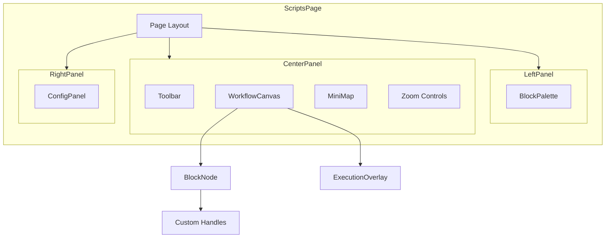

# UI Components Blueprint: NOP Workflow Automation

> **Version**: 1.0  
> **Status**: Draft for Review  
> **Created**: 2026-01-10  

## Overview

The UI is built using React Flow (xyflow) for the canvas, with custom node components and a dark-theme design consistent with NOP's existing interface.

## Component Hierarchy



## Page Layout

```tsx
// frontend/src/pages/Scripts/ScriptsPage.tsx

import React, { useCallback } from 'react';
import { ReactFlowProvider } from '@xyflow/react';
import { useWorkflowStore } from '../../store/workflowStore';
import { WorkflowCanvas } from '../../components/workflow/WorkflowCanvas';
import { BlockPalette } from '../../components/workflow/BlockPalette';
import { ConfigPanel } from '../../components/workflow/ConfigPanel';
import { Toolbar } from '../../components/workflow/Toolbar';

export const ScriptsPage: React.FC = () => {
  const { isPaletteOpen, isConfigPanelOpen, selectedNodeId } = useWorkflowStore();
  
  return (
    <div className="flex h-full bg-gray-900">
      {/* Left Panel - Block Palette */}
      <div 
        className={`
          transition-all duration-300 border-r border-gray-700
          ${isPaletteOpen ? 'w-64' : 'w-0'}
        `}
      >
        {isPaletteOpen && <BlockPalette />}
      </div>
      
      {/* Center - Canvas */}
      <div className="flex-1 flex flex-col">
        <Toolbar />
        <ReactFlowProvider>
          <WorkflowCanvas />
        </ReactFlowProvider>
      </div>
      
      {/* Right Panel - Config */}
      <div 
        className={`
          transition-all duration-300 border-l border-gray-700
          ${isConfigPanelOpen && selectedNodeId ? 'w-80' : 'w-0'}
        `}
      >
        {isConfigPanelOpen && selectedNodeId && <ConfigPanel />}
      </div>
    </div>
  );
};
```

## React Flow Canvas Configuration

```tsx
// frontend/src/components/workflow/WorkflowCanvas.tsx

import React, { useCallback, useRef } from 'react';
import ReactFlow, {
  ReactFlowInstance,
  Connection,
  Edge,
  Node,
  Controls,
  MiniMap,
  Background,
  BackgroundVariant,
  useNodesState,
  useEdgesState,
  addEdge,
  Panel,
} from '@xyflow/react';
import '@xyflow/react/dist/style.css';

import { useWorkflowStore } from '../../store/workflowStore';
import { BlockNode } from './BlockNode';
import { ExecutionOverlay } from './ExecutionOverlay';
import { BLOCK_DEFINITIONS } from '../../types/blocks';

// Custom node types
const nodeTypes = {
  block: BlockNode,
};

// Edge styling
const defaultEdgeOptions = {
  type: 'smoothstep',
  animated: false,
  style: {
    stroke: '#6B7280',
    strokeWidth: 2,
  },
  markerEnd: {
    type: 'arrowclosed',
    color: '#6B7280',
  },
};

export const WorkflowCanvas: React.FC = () => {
  const reactFlowWrapper = useRef<HTMLDivElement>(null);
  const [reactFlowInstance, setReactFlowInstance] = 
    React.useState<ReactFlowInstance | null>(null);
  
  const {
    nodes,
    edges,
    setNodes,
    setEdges,
    addNode,
    onNodesChange,
    onEdgesChange,
    selectNode,
    executionState,
  } = useWorkflowStore();
  
  // Handle new connections
  const onConnect = useCallback(
    (connection: Connection) => {
      // Validate connection
      if (!isValidConnection(connection)) return;
      
      setEdges((eds) => addEdge({
        ...connection,
        ...defaultEdgeOptions,
      }, eds));
    },
    [setEdges]
  );
  
  // Handle drag-and-drop from palette
  const onDragOver = useCallback((event: React.DragEvent) => {
    event.preventDefault();
    event.dataTransfer.dropEffect = 'move';
  }, []);
  
  const onDrop = useCallback(
    (event: React.DragEvent) => {
      event.preventDefault();
      
      const blockType = event.dataTransfer.getData('application/reactflow');
      if (!blockType || !reactFlowInstance) return;
      
      const position = reactFlowInstance.screenToFlowPosition({
        x: event.clientX,
        y: event.clientY,
      });
      
      addNode(blockType, position);
    },
    [reactFlowInstance, addNode]
  );
  
  // Handle node selection
  const onNodeClick = useCallback(
    (_: React.MouseEvent, node: Node) => {
      selectNode(node.id);
    },
    [selectNode]
  );
  
  // Handle canvas click (deselect)
  const onPaneClick = useCallback(() => {
    selectNode(null);
  }, [selectNode]);
  
  // Validate connections
  const isValidConnection = (connection: Connection): boolean => {
    // Prevent self-connections
    if (connection.source === connection.target) return false;
    
    // Prevent duplicate connections
    const exists = edges.some(
      (e) =>
        e.source === connection.source &&
        e.target === connection.target &&
        e.sourceHandle === connection.sourceHandle
    );
    if (exists) return false;
    
    // Validate handle compatibility
    const sourceNode = nodes.find((n) => n.id === connection.source);
    const targetNode = nodes.find((n) => n.id === connection.target);
    
    if (!sourceNode || !targetNode) return false;
    
    // Only output handles can connect to input handles
    // (React Flow handles this, but we can add custom logic)
    
    return true;
  };
  
  return (
    <div ref={reactFlowWrapper} className="flex-1 relative">
      <ReactFlow
        nodes={nodes}
        edges={edges}
        onNodesChange={onNodesChange}
        onEdgesChange={onEdgesChange}
        onConnect={onConnect}
        onInit={setReactFlowInstance}
        onDrop={onDrop}
        onDragOver={onDragOver}
        onNodeClick={onNodeClick}
        onPaneClick={onPaneClick}
        nodeTypes={nodeTypes}
        defaultEdgeOptions={defaultEdgeOptions}
        fitView
        snapToGrid
        snapGrid={[16, 16]}
        minZoom={0.1}
        maxZoom={2}
        proOptions={{ hideAttribution: true }}
        className="bg-gray-900"
      >
        {/* Grid Background */}
        <Background
          variant={BackgroundVariant.Dots}
          gap={16}
          size={1}
          color="#374151"
        />
        
        {/* Zoom Controls */}
        <Controls
          className="bg-gray-800 border-gray-700"
          showInteractive={false}
        />
        
        {/* Mini Map */}
        <MiniMap
          className="bg-gray-800 border border-gray-700"
          nodeColor={(node) => {
            const def = BLOCK_DEFINITIONS[node.data.type];
            return def?.color ?? '#6B7280';
          }}
          maskColor="rgba(0, 0, 0, 0.8)"
          pannable
          zoomable
        />
        
        {/* Execution Overlay */}
        {executionState && (
          <Panel position="top-center">
            <ExecutionOverlay state={executionState} />
          </Panel>
        )}
      </ReactFlow>
    </div>
  );
};
```

## Custom Node Component

```tsx
// frontend/src/components/workflow/BlockNode.tsx

import React, { memo } from 'react';
import { Handle, Position, NodeProps } from '@xyflow/react';
import { useWorkflowStore } from '../../store/workflowStore';
import { BLOCK_DEFINITIONS, BlockDefinition } from '../../types/blocks';
import { NodeExecutionStatus } from '../../types/workflow';

interface BlockNodeData {
  type: string;
  label: string;
  config: Record<string, any>;
}

const statusColors: Record<NodeExecutionStatus, string> = {
  pending: 'border-gray-500',
  waiting: 'border-yellow-500',
  running: 'border-blue-500 animate-pulse',
  completed: 'border-green-500',
  failed: 'border-red-500',
  skipped: 'border-gray-400 opacity-50',
};

const statusIcons: Record<NodeExecutionStatus, string> = {
  pending: '○',
  waiting: '◐',
  running: '◆',
  completed: '✓',
  failed: '✗',
  skipped: '⊘',
};

export const BlockNode: React.FC<NodeProps<BlockNodeData>> = memo(({ 
  id, 
  data, 
  selected 
}) => {
  const { nodeStatuses } = useWorkflowStore();
  const definition: BlockDefinition = BLOCK_DEFINITIONS[data.type];
  
  if (!definition) {
    return <div className="bg-red-800 p-2">Unknown block: {data.type}</div>;
  }
  
  const status = nodeStatuses.get(id) ?? 'pending';
  const statusColor = statusColors[status];
  const statusIcon = statusIcons[status];
  
  return (
    <div
      className={`
        min-w-[180px] rounded-lg shadow-lg
        border-2 ${statusColor}
        ${selected ? 'ring-2 ring-blue-400' : ''}
        transition-all duration-200
      `}
      style={{ backgroundColor: `${definition.color}20` }}
    >
      {/* Header */}
      <div
        className="px-3 py-2 rounded-t-md flex items-center gap-2"
        style={{ backgroundColor: definition.color }}
      >
        <span className="text-lg">{definition.icon}</span>
        <span className="text-white font-medium text-sm truncate flex-1">
          {data.label || definition.label}
        </span>
        <span className="text-white text-xs opacity-75">{statusIcon}</span>
      </div>
      
      {/* Body */}
      <div className="px-3 py-2 bg-gray-800/80 rounded-b-md">
        {/* Summary of key config */}
        <ConfigSummary config={data.config} definition={definition} />
      </div>
      
      {/* Input Handles */}
      {definition.inputs.map((input, index) => (
        <Handle
          key={`in-${input.id}`}
          type="target"
          position={Position.Left}
          id={input.id}
          className="!w-3 !h-3 !bg-gray-400 !border-2 !border-gray-600"
          style={{ top: `${30 + index * 20}px` }}
          title={input.label}
        />
      ))}
      
      {/* Output Handles */}
      {definition.outputs.map((output, index) => (
        <Handle
          key={`out-${output.id}`}
          type="source"
          position={Position.Right}
          id={output.id}
          className={`
            !w-3 !h-3 !border-2 !border-gray-600
            ${output.id === 'success' || output.id === 'true' ? '!bg-green-400' : ''}
            ${output.id === 'failure' || output.id === 'false' || output.id === 'error' ? '!bg-red-400' : ''}
            ${!['success', 'failure', 'true', 'false', 'error'].includes(output.id) ? '!bg-blue-400' : ''}
          `}
          style={{ top: `${30 + index * 20}px` }}
          title={output.label}
        />
      ))}
    </div>
  );
});

// Config summary for node body
const ConfigSummary: React.FC<{
  config: Record<string, any>;
  definition: BlockDefinition;
}> = ({ config, definition }) => {
  // Show key parameters
  const keyParams = definition.parameters
    .filter((p) => p.required)
    .slice(0, 2);
  
  if (keyParams.length === 0) {
    return <span className="text-gray-400 text-xs">No configuration</span>;
  }
  
  return (
    <div className="space-y-1">
      {keyParams.map((param) => (
        <div key={param.name} className="flex text-xs">
          <span className="text-gray-400 w-16 truncate">{param.name}:</span>
          <span className="text-gray-200 truncate flex-1">
            {config[param.name] || '(not set)'}
          </span>
        </div>
      ))}
    </div>
  );
};

BlockNode.displayName = 'BlockNode';
```

## Block Palette

```tsx
// frontend/src/components/workflow/BlockPalette.tsx

import React, { useState } from 'react';
import { BLOCK_DEFINITIONS, BLOCK_CATEGORIES, BlockCategory } from '../../types/blocks';

export const BlockPalette: React.FC = () => {
  const [searchTerm, setSearchTerm] = useState('');
  const [expandedCategories, setExpandedCategories] = useState<Set<string>>(
    new Set(Object.keys(BLOCK_CATEGORIES))
  );
  
  const toggleCategory = (category: string) => {
    setExpandedCategories((prev) => {
      const next = new Set(prev);
      if (next.has(category)) {
        next.delete(category);
      } else {
        next.add(category);
      }
      return next;
    });
  };
  
  const filteredBlocks = Object.entries(BLOCK_DEFINITIONS).filter(
    ([type, def]) =>
      def.label.toLowerCase().includes(searchTerm.toLowerCase()) ||
      type.toLowerCase().includes(searchTerm.toLowerCase())
  );
  
  const blocksByCategory = Object.entries(BLOCK_CATEGORIES).map(([key, cat]) => ({
    ...cat,
    key,
    blocks: filteredBlocks.filter(([type]) => type.startsWith(key)),
  }));
  
  const onDragStart = (event: React.DragEvent, blockType: string) => {
    event.dataTransfer.setData('application/reactflow', blockType);
    event.dataTransfer.effectAllowed = 'move';
  };
  
  return (
    <div className="h-full flex flex-col bg-gray-800">
      {/* Search */}
      <div className="p-3 border-b border-gray-700">
        <input
          type="text"
          placeholder="Search blocks..."
          value={searchTerm}
          onChange={(e) => setSearchTerm(e.target.value)}
          className="
            w-full px-3 py-2 rounded-md
            bg-gray-700 text-white placeholder-gray-400
            border border-gray-600 focus:border-blue-500
            focus:outline-none
          "
        />
      </div>
      
      {/* Categories */}
      <div className="flex-1 overflow-y-auto p-2">
        {blocksByCategory.map((category) => (
          <div key={category.key} className="mb-2">
            {/* Category Header */}
            <button
              onClick={() => toggleCategory(category.key)}
              className="
                w-full flex items-center gap-2 px-2 py-1.5
                text-left text-sm font-medium text-gray-300
                hover:bg-gray-700 rounded
              "
            >
              <span
                className="w-3 h-3 rounded-sm"
                style={{ backgroundColor: category.color }}
              />
              <span className="flex-1">{category.label}</span>
              <span className="text-gray-500">
                {expandedCategories.has(category.key) ? '▼' : '▶'}
              </span>
            </button>
            
            {/* Blocks */}
            {expandedCategories.has(category.key) && (
              <div className="ml-4 mt-1 space-y-1">
                {category.blocks.map(([type, def]) => (
                  <div
                    key={type}
                    draggable
                    onDragStart={(e) => onDragStart(e, type)}
                    className="
                      flex items-center gap-2 px-2 py-1.5
                      bg-gray-700/50 rounded cursor-grab
                      hover:bg-gray-600/50 transition-colors
                      active:cursor-grabbing
                    "
                    title={def.description}
                  >
                    <span>{def.icon}</span>
                    <span className="text-sm text-gray-200">{def.label}</span>
                  </div>
                ))}
                
                {category.blocks.length === 0 && (
                  <span className="text-xs text-gray-500 px-2">
                    No matching blocks
                  </span>
                )}
              </div>
            )}
          </div>
        ))}
      </div>
      
      {/* Footer */}
      <div className="p-2 border-t border-gray-700 text-center text-xs text-gray-500">
        Drag blocks to canvas
      </div>
    </div>
  );
};
```

## Config Panel

```tsx
// frontend/src/components/workflow/ConfigPanel.tsx

import React from 'react';
import { useWorkflowStore } from '../../store/workflowStore';
import { BLOCK_DEFINITIONS, BlockParameter } from '../../types/blocks';

export const ConfigPanel: React.FC = () => {
  const { 
    nodes, 
    selectedNodeId, 
    updateNodeConfig, 
    updateNodeLabel,
    removeNode 
  } = useWorkflowStore();
  
  const node = nodes.find((n) => n.id === selectedNodeId);
  if (!node) return null;
  
  const definition = BLOCK_DEFINITIONS[node.data.type];
  if (!definition) return null;
  
  const handleConfigChange = (name: string, value: any) => {
    updateNodeConfig(node.id, { ...node.data.config, [name]: value });
  };
  
  return (
    <div className="h-full flex flex-col bg-gray-800 overflow-hidden">
      {/* Header */}
      <div
        className="px-4 py-3 border-b border-gray-700 flex items-center gap-2"
        style={{ backgroundColor: `${definition.color}30` }}
      >
        <span className="text-lg">{definition.icon}</span>
        <div className="flex-1">
          <input
            type="text"
            value={node.data.label || ''}
            onChange={(e) => updateNodeLabel(node.id, e.target.value)}
            placeholder={definition.label}
            className="
              w-full bg-transparent text-white font-medium
              border-b border-transparent focus:border-white
              focus:outline-none
            "
          />
          <div className="text-xs text-gray-400">{node.data.type}</div>
        </div>
        <button
          onClick={() => removeNode(node.id)}
          className="text-red-400 hover:text-red-300 p-1"
          title="Delete block"
        >
          🗑️
        </button>
      </div>
      
      {/* Parameters */}
      <div className="flex-1 overflow-y-auto p-4 space-y-4">
        {definition.parameters.map((param) => (
          <ParameterInput
            key={param.name}
            parameter={param}
            value={node.data.config[param.name]}
            onChange={(value) => handleConfigChange(param.name, value)}
          />
        ))}
        
        {definition.parameters.length === 0 && (
          <div className="text-gray-500 text-sm text-center py-4">
            No configuration required
          </div>
        )}
      </div>
      
      {/* Credential Selector */}
      {definition.parameters.some((p) => p.name === 'credential_id') && (
        <CredentialSelector
          value={node.data.config.credential_id}
          onChange={(id) => handleConfigChange('credential_id', id)}
        />
      )}
      
      {/* Output Preview */}
      <div className="border-t border-gray-700 p-4">
        <h4 className="text-sm font-medium text-gray-400 mb-2">Outputs</h4>
        <div className="flex flex-wrap gap-2">
          {definition.outputs.map((output) => (
            <span
              key={output.id}
              className="
                px-2 py-1 text-xs rounded
                bg-gray-700 text-gray-300
              "
            >
              {output.label}
            </span>
          ))}
        </div>
      </div>
    </div>
  );
};

// Parameter input component
const ParameterInput: React.FC<{
  parameter: BlockParameter;
  value: any;
  onChange: (value: any) => void;
}> = ({ parameter, value, onChange }) => {
  const inputClasses = `
    w-full px-3 py-2 rounded-md
    bg-gray-700 text-white placeholder-gray-400
    border border-gray-600 focus:border-blue-500
    focus:outline-none text-sm
  `;
  
  const renderInput = () => {
    switch (parameter.type) {
      case 'string':
        return (
          <input
            type="text"
            value={value ?? parameter.default ?? ''}
            onChange={(e) => onChange(e.target.value)}
            placeholder={parameter.placeholder}
            className={inputClasses}
          />
        );
        
      case 'number':
        return (
          <input
            type="number"
            value={value ?? parameter.default ?? ''}
            onChange={(e) => onChange(Number(e.target.value))}
            min={parameter.min}
            max={parameter.max}
            className={inputClasses}
          />
        );
        
      case 'boolean':
        return (
          <label className="flex items-center gap-2 cursor-pointer">
            <input
              type="checkbox"
              checked={value ?? parameter.default ?? false}
              onChange={(e) => onChange(e.target.checked)}
              className="w-4 h-4 rounded bg-gray-700 border-gray-600"
            />
            <span className="text-sm text-gray-300">
              {parameter.description}
            </span>
          </label>
        );
        
      case 'enum':
        return (
          <select
            value={value ?? parameter.default ?? ''}
            onChange={(e) => onChange(e.target.value)}
            className={inputClasses}
          >
            <option value="">Select...</option>
            {parameter.options?.map((opt) => (
              <option key={opt} value={opt}>
                {opt}
              </option>
            ))}
          </select>
        );
        
      case 'text':
        return (
          <textarea
            value={value ?? parameter.default ?? ''}
            onChange={(e) => onChange(e.target.value)}
            placeholder={parameter.placeholder}
            rows={3}
            className={inputClasses}
          />
        );
        
      case 'expression':
        return (
          <div className="relative">
            <input
              type="text"
              value={value ?? ''}
              onChange={(e) => onChange(e.target.value)}
              placeholder="{{ $prev.output }}"
              className={`${inputClasses} font-mono`}
            />
            <span className="absolute right-2 top-2 text-yellow-500 text-xs">
              fx
            </span>
          </div>
        );
        
      default:
        return (
          <input
            type="text"
            value={value ?? ''}
            onChange={(e) => onChange(e.target.value)}
            className={inputClasses}
          />
        );
    }
  };
  
  return (
    <div>
      <label className="block mb-1">
        <span className="text-sm text-gray-300">
          {parameter.label || parameter.name}
          {parameter.required && <span className="text-red-400 ml-1">*</span>}
        </span>
      </label>
      {renderInput()}
      {parameter.description && parameter.type !== 'boolean' && (
        <p className="mt-1 text-xs text-gray-500">{parameter.description}</p>
      )}
    </div>
  );
};

// Credential selector component
const CredentialSelector: React.FC<{
  value: string | undefined;
  onChange: (id: string) => void;
}> = ({ value, onChange }) => {
  // In real implementation, fetch credentials from API
  const credentials = [
    { id: '1', name: 'SSH Root', protocol: 'ssh' },
    { id: '2', name: 'FTP Admin', protocol: 'ftp' },
  ];
  
  return (
    <div className="border-t border-gray-700 p-4">
      <label className="block mb-2 text-sm text-gray-400">
        Use Stored Credential
      </label>
      <select
        value={value ?? ''}
        onChange={(e) => onChange(e.target.value)}
        className="
          w-full px-3 py-2 rounded-md
          bg-gray-700 text-white
          border border-gray-600 focus:border-blue-500
          focus:outline-none text-sm
        "
      >
        <option value="">Use inline credentials</option>
        {credentials.map((cred) => (
          <option key={cred.id} value={cred.id}>
            {cred.name} ({cred.protocol})
          </option>
        ))}
      </select>
    </div>
  );
};
```

## Toolbar

```tsx
// frontend/src/components/workflow/Toolbar.tsx

import React from 'react';
import { useWorkflowStore } from '../../store/workflowStore';

export const Toolbar: React.FC = () => {
  const {
    currentWorkflow,
    executionState,
    isPaletteOpen,
    togglePalette,
    saveWorkflow,
    executeWorkflow,
    stopExecution,
    pauseExecution,
    resumeExecution,
    newWorkflow,
    undo,
    redo,
    canUndo,
    canRedo,
  } = useWorkflowStore();
  
  const isExecuting = executionState?.status === 'running';
  const isPaused = executionState?.status === 'paused';
  
  return (
    <div className="h-12 bg-gray-800 border-b border-gray-700 flex items-center px-4 gap-2">
      {/* Toggle Palette */}
      <button
        onClick={togglePalette}
        className={`
          px-3 py-1.5 rounded text-sm
          ${isPaletteOpen ? 'bg-blue-600 text-white' : 'bg-gray-700 text-gray-300'}
          hover:bg-blue-500 transition-colors
        `}
        title="Toggle block palette"
      >
        📦 Blocks
      </button>
      
      <div className="w-px h-6 bg-gray-600" />
      
      {/* File Operations */}
      <button
        onClick={newWorkflow}
        className="p-1.5 rounded hover:bg-gray-700 text-gray-400"
        title="New workflow"
      >
        📄
      </button>
      
      <button
        onClick={saveWorkflow}
        disabled={isExecuting}
        className="p-1.5 rounded hover:bg-gray-700 text-gray-400 disabled:opacity-50"
        title="Save workflow"
      >
        💾
      </button>
      
      <div className="w-px h-6 bg-gray-600" />
      
      {/* Undo/Redo */}
      <button
        onClick={undo}
        disabled={!canUndo || isExecuting}
        className="p-1.5 rounded hover:bg-gray-700 text-gray-400 disabled:opacity-50"
        title="Undo"
      >
        ↩️
      </button>
      
      <button
        onClick={redo}
        disabled={!canRedo || isExecuting}
        className="p-1.5 rounded hover:bg-gray-700 text-gray-400 disabled:opacity-50"
        title="Redo"
      >
        ↪️
      </button>
      
      <div className="flex-1" />
      
      {/* Workflow Name */}
      <span className="text-gray-400 text-sm">
        {currentWorkflow?.name || 'Untitled Workflow'}
      </span>
      
      <div className="flex-1" />
      
      {/* Execution Controls */}
      {!isExecuting && !isPaused && (
        <button
          onClick={executeWorkflow}
          className="
            px-4 py-1.5 rounded bg-green-600 text-white text-sm
            hover:bg-green-500 transition-colors flex items-center gap-2
          "
        >
          ▶️ Run
        </button>
      )}
      
      {isExecuting && (
        <>
          <button
            onClick={pauseExecution}
            className="
              px-3 py-1.5 rounded bg-yellow-600 text-white text-sm
              hover:bg-yellow-500 transition-colors
            "
          >
            ⏸️ Pause
          </button>
          
          <button
            onClick={stopExecution}
            className="
              px-3 py-1.5 rounded bg-red-600 text-white text-sm
              hover:bg-red-500 transition-colors
            "
          >
            ⏹️ Stop
          </button>
        </>
      )}
      
      {isPaused && (
        <>
          <button
            onClick={resumeExecution}
            className="
              px-3 py-1.5 rounded bg-green-600 text-white text-sm
              hover:bg-green-500 transition-colors
            "
          >
            ▶️ Resume
          </button>
          
          <button
            onClick={stopExecution}
            className="
              px-3 py-1.5 rounded bg-red-600 text-white text-sm
              hover:bg-red-500 transition-colors
            "
          >
            ⏹️ Stop
          </button>
        </>
      )}
      
      {/* Progress */}
      {executionState && (
        <div className="flex items-center gap-2 ml-2">
          <div className="w-32 h-2 bg-gray-700 rounded-full overflow-hidden">
            <div
              className={`h-full transition-all ${
                executionState.status === 'failed' ? 'bg-red-500' :
                executionState.status === 'completed' ? 'bg-green-500' :
                'bg-blue-500'
              }`}
              style={{ width: `${executionState.progress.percentage}%` }}
            />
          </div>
          <span className="text-xs text-gray-400">
            {executionState.progress.completed}/{executionState.progress.total}
          </span>
        </div>
      )}
    </div>
  );
};
```

## Execution Overlay

```tsx
// frontend/src/components/workflow/ExecutionOverlay.tsx

import React from 'react';
import { ExecutionState } from '../../types/workflow';

interface ExecutionOverlayProps {
  state: ExecutionState;
}

export const ExecutionOverlay: React.FC<ExecutionOverlayProps> = ({ state }) => {
  const statusConfig = {
    compiling: { color: 'blue', icon: '⚙️', text: 'Compiling...' },
    validating: { color: 'blue', icon: '🔍', text: 'Validating...' },
    running: { color: 'blue', icon: '▶️', text: 'Running...' },
    paused: { color: 'yellow', icon: '⏸️', text: 'Paused' },
    completed: { color: 'green', icon: '✓', text: 'Completed' },
    failed: { color: 'red', icon: '✗', text: 'Failed' },
    cancelled: { color: 'gray', icon: '⏹️', text: 'Cancelled' },
  };
  
  const config = statusConfig[state.status] || statusConfig.running;
  
  return (
    <div
      className={`
        px-4 py-2 rounded-lg shadow-lg
        bg-gray-800 border border-${config.color}-500
        flex items-center gap-3
      `}
    >
      <span className="text-lg">{config.icon}</span>
      <div>
        <div className="text-white font-medium">{config.text}</div>
        <div className="text-xs text-gray-400">
          Level {state.currentLevel + 1} of {state.totalLevels}
        </div>
      </div>
      
      {/* Live stats */}
      <div className="ml-4 flex gap-4 text-xs">
        <div>
          <span className="text-green-400">
            {Array.from(state.nodeStatuses.values()).filter(s => s === 'completed').length}
          </span>
          <span className="text-gray-500"> done</span>
        </div>
        <div>
          <span className="text-blue-400">
            {Array.from(state.nodeStatuses.values()).filter(s => s === 'running').length}
          </span>
          <span className="text-gray-500"> running</span>
        </div>
        <div>
          <span className="text-red-400">
            {Array.from(state.nodeStatuses.values()).filter(s => s === 'failed').length}
          </span>
          <span className="text-gray-500"> failed</span>
        </div>
      </div>
      
      {/* Duration */}
      {state.startedAt && (
        <div className="text-xs text-gray-400 ml-4">
          {formatDuration(Date.now() - state.startedAt.getTime())}
        </div>
      )}
    </div>
  );
};

function formatDuration(ms: number): string {
  const seconds = Math.floor(ms / 1000);
  const minutes = Math.floor(seconds / 60);
  if (minutes > 0) {
    return `${minutes}m ${seconds % 60}s`;
  }
  return `${seconds}s`;
}
```

## Component Styling Summary

| Component | Background | Border | Text |
|-----------|------------|--------|------|
| Page | `gray-900` | - | - |
| Palette | `gray-800` | `gray-700` | `gray-200` |
| Canvas | `gray-900` | - | - |
| Nodes | `{color}20` | `{color}` | `white` |
| Config Panel | `gray-800` | `gray-700` | `gray-200` |
| Toolbar | `gray-800` | `gray-700` | `gray-300` |
| Inputs | `gray-700` | `gray-600` | `white` |

## Responsive Design

```tsx
// Breakpoint handling
const useBreakpoint = () => {
  const [breakpoint, setBreakpoint] = useState('lg');
  
  useEffect(() => {
    const handleResize = () => {
      if (window.innerWidth < 768) setBreakpoint('sm');
      else if (window.innerWidth < 1024) setBreakpoint('md');
      else setBreakpoint('lg');
    };
    
    window.addEventListener('resize', handleResize);
    handleResize();
    return () => window.removeEventListener('resize', handleResize);
  }, []);
  
  return breakpoint;
};

// In ScriptsPage
const breakpoint = useBreakpoint();

// Auto-collapse panels on small screens
useEffect(() => {
  if (breakpoint === 'sm') {
    setPaletteOpen(false);
    setConfigPanelOpen(false);
  }
}, [breakpoint]);
```

## Accessibility

```tsx
// Keyboard navigation
const WorkflowCanvas: React.FC = () => {
  useEffect(() => {
    const handleKeyDown = (e: KeyboardEvent) => {
      if (e.key === 'Delete' && selectedNodeId) {
        removeNode(selectedNodeId);
      }
      if (e.key === 'Escape') {
        selectNode(null);
      }
      if (e.ctrlKey && e.key === 's') {
        e.preventDefault();
        saveWorkflow();
      }
      if (e.ctrlKey && e.key === 'z') {
        e.preventDefault();
        undo();
      }
      if (e.ctrlKey && e.shiftKey && e.key === 'z') {
        e.preventDefault();
        redo();
      }
    };
    
    window.addEventListener('keydown', handleKeyDown);
    return () => window.removeEventListener('keydown', handleKeyDown);
  }, [selectedNodeId]);
  
  // ... rest of component
};
```

## Summary

The UI consists of:

1. **ScriptsPage**: Main container with three-panel layout
2. **BlockPalette**: Draggable block list organized by category
3. **WorkflowCanvas**: React Flow-based visual editor
4. **BlockNode**: Custom node component with status indicators
5. **ConfigPanel**: Right-side parameter configuration
6. **Toolbar**: File operations and execution controls
7. **ExecutionOverlay**: Real-time execution status

All components follow NOP's dark theme with consistent styling and responsive design.
