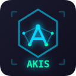

# AKIS Monitor - VSCode Extension



Monitor and visualize AKIS (Agents, Knowledge, Instructions, Skills) system workflows, decisions, and knowledge graphs directly in Visual Studio Code.

## Features

✨ **Live Session Monitoring**: Real-time view of the currently active AKIS agent session
  - Reads from `.akis-session.json` (written by agents during execution)
  - Current phase and progress tracking (7-phase workflow)
  - Decisions made so far in the session
  - Session timeline with emissions
  - Auto-refreshes every 2 seconds
  - Fallback to workflow log monitoring if session file doesn't exist

📊 **Historical Diagram**: Interactive Mermaid diagrams showing decision points and delegations

🕸️ **Knowledge Graph**: D3.js force-directed graph of entities from `project_knowledge.json`
  - Entity nodes with relationships
  - Interactive zoom and pan
  - Code graph dependencies visualization

🎨 **Cyberpunk Theme**: Matches the NOP platform aesthetic with cyan/dark colors

⚡ **Auto-refresh**: Automatically updates when files change (configurable interval)

## Installation

### From VS Code Marketplace (Coming Soon)

Search for "AKIS Monitor" in the Extensions view (Ctrl+Shift+X).

### From VSIX (Recommended)

1. Package the extension:
   ```bash
   cd vscode-extension
   npm install
   npm run compile
   npm run package
   ```

2. Install in VSCode:
   - Open VSCode
   - Go to Extensions (Ctrl+Shift+X)
   - Click the "..." menu → "Install from VSIX..."
   - Select the generated `.vsix` file

### From Source

1. Clone and prepare:
   ```bash
   cd vscode-extension
   npm install
   npm run compile
   ```

2. Press F5 in VSCode to launch Extension Development Host

## Usage

### Opening AKIS Monitor

1. Click the AKIS icon in the Activity Bar (left sidebar)
2. Four views will appear:
   - **Live Session**: Shows the currently active AKIS agent session
   - **Workflow History**: Shows all completed workflows
   - **Decision Diagram**: Visualizes decision flows
   - **Knowledge Graph**: Interactive entity graph

### Workspace Setup

AKIS Monitor expects your workspace to have:
- `log/workflow/*.md` - Workflow log files
- `project_knowledge.json` - Knowledge entities (JSONL format)

Configure paths in VSCode settings if your structure differs.

## Configuration

Access settings via File → Preferences → Settings → Search "AKIS Monitor":

| Setting | Default | Description |
|---------|---------|-------------|
| `akisMonitor.workflowLogsPath` | `log/workflow` | Path to workflow logs directory |
| `akisMonitor.knowledgeFilePath` | `project_knowledge.json` | Path to knowledge file |
| `akisMonitor.autoRefresh` | `true` | Auto-refresh on file changes |
| `akisMonitor.refreshInterval` | `2000` | Refresh debounce interval (ms) |

## Commands

- **AKIS: Refresh Workflow** - Manually refresh workflow tree
- **AKIS: Refresh Decisions** - Manually refresh decision diagram
- **AKIS: Refresh Knowledge Graph** - Manually refresh knowledge graph
- **AKIS: Export Current Diagram** - Export visualization (coming soon)

## Workflow Log Format

The extension parses workflow logs in this format:

```markdown
# Workflow Log: Task Description

**Session**: 2025-12-28_234846
**Task**: Task name
**Agent**: _DevTeam
**Status**: Completed

## Summary
Brief summary of the workflow...

[DECISIONS]
- Decision 1
- Decision 2

[TOOLS_USED]
- Tool: Purpose

[DELEGATIONS]
agent=Name | task=Description | result=Outcome
```

## Knowledge File Format

Expects JSONL (JSON Lines) format:

```json
{"type": "entity", "name": "Entity.Name", "entityType": "type", "observations": ["obs1", "obs2"]}
```

## Integration with Memviz

For visualizing Anthropic memory graphs:
1. Click "Open Memviz" button in Knowledge Graph view
2. Export your knowledge data in Anthropic format
3. Upload to https://memviz.anthropic.com/

## Development

```bash
# Install dependencies
npm install

# Compile TypeScript
npm run compile

# Watch mode
npm run watch

# Lint
npm run lint

# Package extension
npm run package
```

## Architecture

```
vscode-extension/
├── src/
│   ├── extension.ts              # Entry point
│   ├── providers/                # Webview providers
│   │   ├── WorkflowViewProvider.ts
│   │   ├── DecisionViewProvider.ts
│   │   └── KnowledgeViewProvider.ts
│   ├── parsers/                  # Data parsers
│   │   ├── WorkflowParser.ts
│   │   └── KnowledgeParser.ts
│   ├── watchers/                 # File watchers
│   │   └── WorkflowWatcher.ts
│   └── types/                    # TypeScript types
│       └── index.ts
├── resources/                    # Icons and assets
└── package.json                  # Extension manifest
```

## Technologies

- **TypeScript** - Type-safe development
- **VSCode Webview API** - Sidebar panels
- **D3.js** - Knowledge graph visualization
- **Mermaid.js** - Decision diagram rendering
- **Node.js fs watchers** - Real-time file monitoring

## Contributing

This extension is part of the NOP (Network Observatory Platform) project. Follow the AKIS framework guidelines when contributing:

1. Follow the 7-phase workflow (CONTEXT → PLAN → COORDINATE → INTEGRATE → VERIFY → LEARN → COMPLETE)
2. Document decisions in workflow logs
3. Update knowledge graph when adding patterns
4. Maintain cyberpunk theme consistency

## License

See NOP project LICENSE file.

## Troubleshooting

### "No workflow logs found"
- Verify `log/workflow/` directory exists in workspace root
- Check file naming: `YYYY-MM-DD_HHMMSS_task-name.md`
- Adjust `akisMonitor.workflowLogsPath` setting

### "No knowledge data found"
- Verify `project_knowledge.json` exists
- Check file format (JSONL)
- Adjust `akisMonitor.knowledgeFilePath` setting

### Extension not activating
- Ensure workspace folder is open (not just files)
- Check VSCode output panel for errors
- Verify extension is enabled

## Roadmap

- [ ] Export diagrams as PNG/SVG
- [ ] Filter workflows by agent/status
- [ ] Timeline view for workflow history
- [ ] Live chat monitoring (parse agent conversations)
- [ ] Custom knowledge graph layouts
- [ ] Integration with GitHub Actions for CI workflows
- [ ] Anthropic memory format compatibility

## Links

- [NOP Repository](https://github.com/goranjovic55/NOP)
- [AKIS Framework Documentation](https://github.com/goranjovic55/NOP/blob/main/.github/copilot-instructions.md)
- [Memviz](https://memviz.anthropic.com/)
