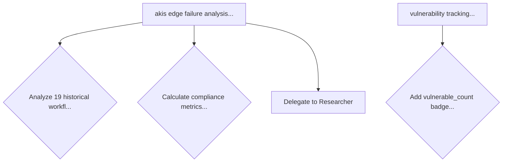

# AKIS Monitor Extension - Usage Examples

## Quick Demo

### 1. Install the Extension

```bash
cd vscode-extension
code --install-extension akis-monitor-0.1.0.vsix
```

### 2. Open NOP Workspace

Open the NOP repository folder in VSCode to see the extension in action.

### 3. View AKIS Monitor

Click the hexagonal AKIS icon in the Activity Bar (left sidebar). You'll see three panels:

## Panel 1: Workflow Tree

**What it shows**: All workflow logs from `log/workflow/` directory

**Features**:
- Chronological list of all agent workflows
- Color-coded status (green = completed, yellow = in-progress)
- Shows agent name, timestamp, and summary
- Displays delegations (which agents were involved)

**Example Display**:
```
┌─────────────────────────────────────────────┐
│ ▶ akis edge failure analysis               │
│   2026-01-01 11:43:00                       │
│   Agent: _DevTeam                          │
│   Delegations: Researcher                   │
│   Status: Completed ✓                       │
├─────────────────────────────────────────────┤
│ ▶ vulnerability tracking badges             │
│   2025-12-31 02:21:45                       │
│   Agent: Developer                          │
│   Status: Completed ✓                       │
└─────────────────────────────────────────────┘
```

## Panel 2: Decision Diagram

**What it shows**: Mermaid flowchart of agent decisions

**Features**:
- Visual flowchart of decision trees
- Shows delegation flows
- Recent decisions list with context

**Example Mermaid Diagram**:


**Recent Decisions Section**:
- Each decision shown with description
- Source workflow and timestamp
- Purple accent color (cyberpunk theme)

## Panel 3: Knowledge Graph

**What it shows**: Interactive D3.js graph of project knowledge

**Features**:
- Force-directed graph layout
- Nodes = entities from `project_knowledge.json`
- Edges = relationships between entities
- Color-coded by entity type:
  - Green: files
  - Cyan: systems
  - Purple: modules
  - Orange: features
  - Pink: services
  - Blue: components

**Interactions**:
- Drag nodes to rearrange
- Hover for full entity name
- Click "Reset View" to re-center
- Click "Open Memviz" to use Anthropic's visualizer

**Statistics Panel**:
```
Knowledge Statistics
─────────────────────
file                  29
system               12
module                8
feature              15
service               9
component             7
─────────────────────
Total Entities       100
Relationships         47
```

## Real-Time Updates

The extension watches for file changes:

### Workflow Logs
- Monitors: `log/workflow/*.md`
- Trigger: New workflow log created or modified
- Effect: Workflow Tree and Decision Diagram refresh

### Knowledge File
- Monitors: `project_knowledge.json`
- Trigger: File modified
- Effect: Knowledge Graph refreshes

### Debouncing
- Default delay: 2000ms (2 seconds)
- Prevents rapid refreshes during bulk changes
- Configurable via settings

## Configuration Examples

### Disable Auto-Refresh
```json
{
  "akisMonitor.autoRefresh": false
}
```

Then manually refresh using toolbar buttons.

### Change Refresh Interval
```json
{
  "akisMonitor.refreshInterval": 5000
}
```

Wait 5 seconds after file change before refreshing.

### Custom Paths
```json
{
  "akisMonitor.workflowLogsPath": "custom/logs/path",
  "akisMonitor.knowledgeFilePath": "data/knowledge.json"
}
```

## Workflow Examples

### Scenario 1: Monitor Active Development

1. Start working on a task with GitHub Copilot
2. Agent creates workflow log in `log/workflow/`
3. AKIS Monitor automatically updates Workflow Tree
4. See real-time decisions in Decision Diagram
5. Watch knowledge graph grow as patterns are learned

### Scenario 2: Review Past Workflows

1. Open Workflow Tree panel
2. Scroll through chronological list
3. Click on a workflow to see details
4. Switch to Decision Diagram to see decision flow
5. Check Knowledge Graph to see what was learned

### Scenario 3: Knowledge Graph Exploration

1. Open Knowledge Graph panel
2. Observe entity clusters (files, systems, features)
3. Drag nodes to explore relationships
4. Check statistics to understand codebase structure
5. Export to Memviz for advanced analysis

## Integration with AKIS Framework

The extension visualizes the complete AKIS workflow:

### Phase Tracking
Workflows show progression through 7 phases:
1. CONTEXT - Load knowledge
2. PLAN - Design approach
3. COORDINATE - Delegate or prepare
4. INTEGRATE - Execute work
5. VERIFY - Test and validate
6. LEARN - Update knowledge
7. COMPLETE - Finish and log

### Agent Collaboration
- _DevTeam orchestration shown in Workflow Tree
- Delegations to Architect, Developer, Reviewer, Researcher
- Decision flows visualized in diagrams

### Knowledge Evolution
- Entity growth tracked in Knowledge Graph
- Relationships show pattern discovery
- Observations accumulate over time

## Troubleshooting Visualizations

### Empty Workflow Tree
**Problem**: No workflows showing  
**Solution**: Verify `log/workflow/` exists and contains `.md` files

### Blank Decision Diagram
**Problem**: No decisions rendering  
**Solution**: Workflow logs must contain `[DECISIONS]` sections

### Empty Knowledge Graph
**Problem**: No nodes displayed  
**Solution**: Check `project_knowledge.json` exists and is valid JSONL

### Graph Not Updating
**Problem**: Changes not reflected  
**Solution**: Click refresh button or check auto-refresh setting

## Advanced Usage

### Export Workflow Data

Currently manual - copy from files:
```bash
# Export all workflow logs
cp log/workflow/*.md export/

# Export knowledge
cp project_knowledge.json export/
```

### Search Workflows

Use VSCode search:
1. Ctrl+Shift+F (Cmd+Shift+F on Mac)
2. Search in `log/workflow/`
3. Filter by agent, decision, or keyword

### Analyze Patterns

1. Review Knowledge Graph statistics
2. Identify entity type distributions
3. Check relationship counts
4. Look for isolated vs connected entities

## Tips & Tricks

1. **Keyboard Navigation**: Use Ctrl+Shift+E to toggle Explorer, Ctrl+Shift+X for Extensions
2. **Panel Resizing**: Drag panel borders to adjust view sizes
3. **Multi-Window**: Open extension in second window for dual-monitor setup
4. **Color Themes**: Extension adapts to your VSCode theme (Dark+, Light, etc.)
5. **Performance**: Large knowledge graphs (>200 nodes) may need manual refresh

## Next Steps

After using the extension:
- Provide feedback on visualization clarity
- Suggest additional metrics to track
- Report any parsing issues with workflow logs
- Contribute improvements via pull requests

## Support

For issues or questions:
- Check INSTALLATION.md for setup help
- Review README.md for feature documentation
- Open issue in NOP repository
- Tag with `akis-monitor` label
